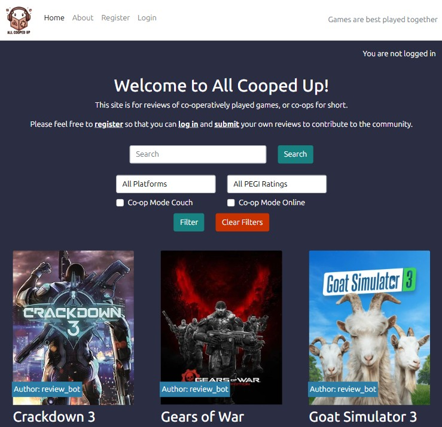

# AllCoopedUp
Full Stack Co-operative Video Game Review Site

- Deployed project can be found [here](https://https://all-cooped-up-12274f373445.herokuapp.com/).

#### A note on the name
"All Cooped Up" is play on words relating to the site's purpose being to review co-operatively played games.  It also harks back to Covid-19 lockdowns where there was an large increase in the numbers of people playing video games together online whilst they were "cooped up" at home. 

## User experience
### Purpose
- All Cooped Up is designed for lovers of co-op games.
- The site has been deployed with a selection of reviews, but users are encouraged to contribute their own reviews to help other users pick the best games to play.
- Filters are available and easy to use so that users can specify a number of factors to limit the number of reviews being presented to them.

## Agile methodology
- Agile methodology is "a set of methods and practices where solutions evolve through collaboration between self-organizing, cross-functional teams" ([reference](https://www.agilealliance.org/agile-essentials/)).
- A project board was set-up to keep track of user stories. Each user story was assigned a 'MoSCoW' prioritisation (must have, should have, could have, won't have) tag. The board can be found [here](https://github.com/users/CharlesTack/projects/16).
- The project board also includes columns for bugs which are open and those which have been closed.

### User stories

Note 4:
Add a selection from the user stories (perhaps just the "Must-Haves")

## Design

Note 5:
Link to the wireframes

### Colour Scheme

Note 6:
Provide text on how I decided on the colours scheme and what tools/sources were used.

#### Colour palette

Note 7:
Provide a breakdown of each colour used and try to get a swatch to display them.

### Typography

Note 8:
Include notes on where the fonts were sourced from and why each font was chosen.  Include examples of the fonts.

## Images

Note 9:
Enter details of where I sources the images from and a note regarding copyright.

## Features:

Note 10:
Enter details for each feature from the document you created.  Use tripe hash/sharp marks for the heading of each feature.  This can be done early as we know the features.

## Database

Note 11:
"I used Code Institute's PostgreSQL database"

### Database planning

Note 12:
Reference the ERD table/diagram and link an image of it.

### Creating a database

Note 13:
Provide a step by step guide to how I got the database URL (i.e. submitted the form and received the link via email)

## Deployment

Note 14:
Note the usage of Heroku and provide a link to the site.

### Heroku:

Note 15:
Provide some notes on Heroku along with a step by step guide on deployment.

### Cloning

Note 16:
Provide some notes and a step by step guide to cloning the repo via Github

### Forking

Note 17:
Provide some notes and a step by step guide to forking the repo via Github

## Technologies used

Note 18:
Provide a list of all technologies used in the production of the site

## The use of AI

Note 19:
Provide detail on the use of AI on the project to satisfy the learning objectives.

## Testing

Note 20:
Link to a separate testing file

## Future plans

Note 21:
Make a note of all of the "Could-Have" user stories which weren't delivered and how and when they might be applied.  Reference back to the agile tutorial for correct terminology.

## Credits

Note 22:
Credit every tool, site and reference I've used on the project

## Acknowledgements

Note 23:
Provide a list of people I'd like to personally thank.
NB. Remember to thank Richard and Emma.