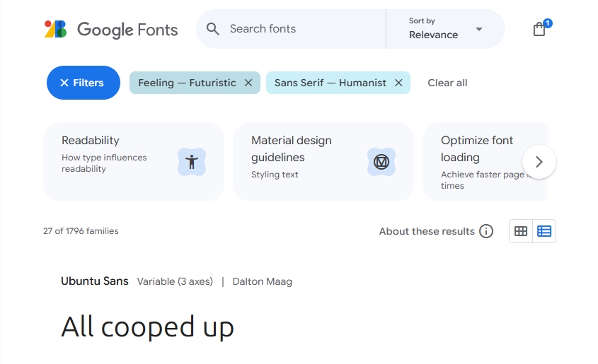
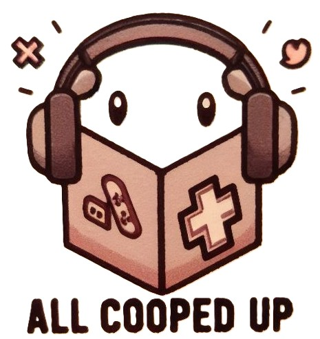
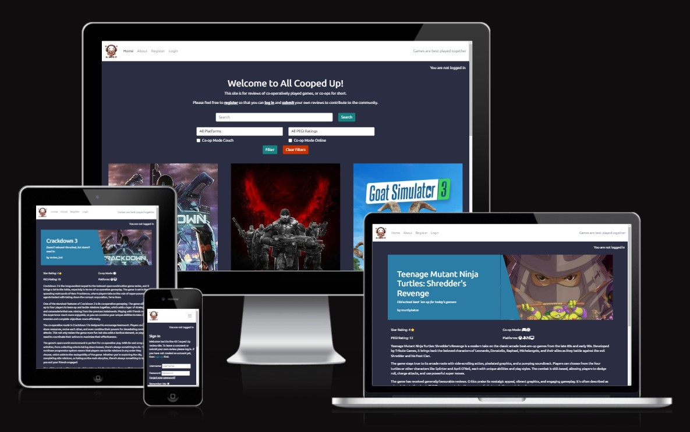
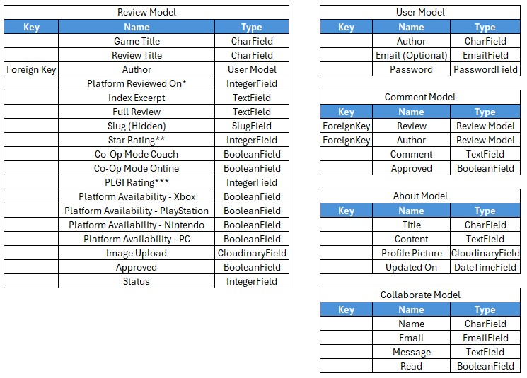

# AllCoopedUp
Full Stack Co-operative Video Game Review Site  

- Deployed project can be found [here](https://all-cooped-up-12274f373445.herokuapp.com/) (right-click to open in a new tab).

#### A note on the name
_"All Cooped Up"_ is play on words relating to the site's purpose being to review co-operatively played games.  It also harks back to Covid-19 lockdowns where there was an large increase in the numbers of people playing video games together online whilst they were "cooped up" at home. 

## User experience
### Purpose
- All Cooped Up is designed for lovers of co-op games.
- The site has been deployed with a selection of reviews, but users are encouraged to contribute their own reviews to help other users pick the best games to play.
- Filters are available and easy to use so that users can specify a number of factors to limit the number of reviews being presented to them.

## Agile methodology
- Agile methodology is "a set of methods and practices where solutions evolve through collaboration between self-organizing, cross-functional teams" ([reference](https://www.agilealliance.org/agile-essentials/)).
- A project board was set-up to keep track of user stories. Each user story was assigned a 'MoSCoW' prioritisation (must have, should have, could have, won't have) tag. The board can be found [here](https://github.com/users/CharlesTack/projects/16).
- The project board also includes columns for bugs which are open and those which have been closed.
An image of my project board taken late in development is below for reference:

### User stories
A total of 27 user stories were created and entered into the project board, categorised into Must-Have (8 stories), Should-Have (11 stories) and Could-Have (8 stories) and labelled appropriately. These were then sorted into To-Do, In Progress and Done columns and were moved through each column during the development.  The full board including all User Stories can be found [here](https://github.com/users/CharlesTack/projects/16).

I have included all of the "Must-Have" stories on a seperate User Stories page [here](static/readme/documents/userstories.md).  Below is a single example to demonstrate how the user stories are composed:

**User Story 14: Inclusivity**  
As a visually impaired user I would like all screens to have good contrast and all images to have alt descriptions so that I have a greater opportunity to be included.
_Acceptance Criteria:_
- The site’s colour scheme should pass contrast checking tests to ensure that it’s easy for all viewers to see.
- All images should have alt text for screen readers and for when images fail to load.
_Tasks:_
- Use appropriate tools to decide on a colour scheme and ensure that rigorous contrast checking is done in the testing stage.
- Use CSS variables to be able to quickly change colours to assist in making sure they have good contrast at the testing stage.
- Code the HTML to use something like: alt="Image of the box art for {{ game.title }}" so that the reviewer doesn’t have to stipulate the alt text manually.

## Design

### Wireframes

A full set of wireframes were created in [Balsamiq](https://balsamiq.com/) to display the design for each and every page in the site.

For example:  
## index.html:  

Screenshots of all wireframes are [here](static/readme/documents/wireframes.md)

### Colour Scheme

Consideration was given to using the colour schemes of video game consoles, such as green, black and white for Xbox, but a decision was taken to not lean towards any platform so that the site is impartial.  [coolors.co](https://coolors.co/) was used to find colours which complimented each other (by using the lock function) whilst being indicative of technology and gaming (and also not being the same as any palette used by the likes of PlayStation).  Once the palette had been selected, the colours were put into CSS variables to allow for quick changes which would be needed to ensure high contrast ratios.  The colours were adjusted slightly from their original shades at the contrast ratio testing stage.  The original palette is shown below:  

#### Colour palette

background-color: #2B2D42; (dark blue - was Space Cadet, now Black Violet)  
primary-color: #FFFFFF; (white used for text on darker colours)  
secondary-color: #2C7DA5; (bright blue - was Blue(NCS), now Prominent Blue)  
tertiary-color: #847089; (dark blush - was Mountbatten Pink, now Purple Grey)  
highlight-color: #D81E5B; (Bright Pink - was Raspberry, now Rose Rush)  
highlight-color-light: #F093B2; (Light Pink - was Amaranth Pink, now Illusion)  

### Typography

[Google Fonts](https://fonts.google.com/) was used to select an appropriately styled font.  The font needed to be easy to read and suitable for a video game related site.  
Filters were applied to limit options to those tagged as "Futuristic" and "Humanist".  Of the options presented, "Ubuntu Sans" felt the most appropriate.  

## Images

All review "box-art" images were sourced from [wikipedia](https://www.wikipedia.org/) due to their position on copyright (an example of which can be found [here](https://en.wikipedia.org/wiki/File:Minecraft_2024_cover_art.png)).  
The site logo, which is used in the navbar, was created using Copilot.  The initial image was unusable in it's original form and so processing to crop and change the background colour was done using the integrated editting tools in the Microsoft Photos app.  
Before and after images are included below:  

## Features:

### Home Page:
The home page is the index of all of the reviews on the site.  It comprises 6 review cards per page which are vertically stacked on mobile devices and 3x2 on tablet sized screens and larger.  It features a navbar, a search/filters section, the main review card section, and a footer.  Via the use of a base.html file, the navbar and footer are visible from each subsequent page.

#### Navbar
There is a navbar which includes the site logo (which doubles as a "home" button), and links to take the user to the "About" page, as well as links to the "Login", "Logout", "Register" and "Add a Review" pages, which dynamically appear and disappear depending on login state.  In the top right corner is the sites motto "Games are best played together".  Feedback messages to users (such as confirmation of comment submission) are presented just below the Navbar.

#### Search/Filters
Just above this section is where the user can see their logged in status.  
A search and filter function has been coded to allow users to search for a specific title either by name (using flexible validation so that "ghost" will return "Tom Clancy's Ghost Recon"), or via a selection of filters.  The filters remain in place even if the user pages forwards (in the case of more than 6 results being returned).  If no matches are found, the user receives a message encouraging them to submit their own review.

#### Main Review Cards
The main section of the home page features video game review cards.  These are Bootstrap cards which feature the game's box-art, a note of who wrote the review, the game title, a one-line summary to entice the user to click on the review, and a collection of icons so that users can easily see such information as which platform the game is available on and it's PEGI rating (used to indicate the game's suitability for different age groups).  
There are Next and Prev buttons beneath the cards which are dynamically visible depending on which page the user is on and how many review cards are present on the page.

#### Footer
A simple footer is included with a Copyright notice and links to YouTube, LinkedIn and Github profile pages.

### Review Detail Page
A banner/masthead section is at the top with the game title, the review title, the author, and a portion of the box-art image.  
The icons detailing certain stats/data are below the masthead to easily show the star-rating, which co-op modes the game has (i.e. couch, online or both), the PEGI rating and which platforms the game is available on (limited to Xbox, PlayStation, Nintendo and PC).  
The main body of the review text is then displayed.  If the author is logged in, they are presented with Edit and Delete buttons which are not visible to any other user.  
Beneath the review text is the comments section which includes a count of comments, previous user's comments, a window to submit a new comment, and if the comment writer is logged in they will also be able to see edit and delete buttons for their own comment which other users can't see.  All comments are subject to administrator approval which is confirmed by the user feedback message which appears at the top of the screen upon submission, as well as being indicated by a message alongside their comment which reads "This comment is awaiting approval".  The user can edit comments which are still pending approval.  
Both delete buttons produce a modal window which seeks confirmation of the request to delete, before a further user feedback message is given confirming deletion.

### Submit Review Page
A form is included on this page for users to submit their own reviews.  There are mandatory and non-mandatory fields here which are designed to make the review quick and easy to submit whilst only needing the fields which the site needs to function properly.  A "missing box-art" image is included if the user does not upload one, and a copyright message is noted at the bottom of the page to ensure images are used legally.

### About Page
An about page is included to give the user more information on the background of the site creator, and includes an image as well as a collaboration request form.  Potential collaborators are invited to contact the site creator and are provided with a confirmation message on submission.  The form is also used for other contact purposes (such as any issues with password resets).  A further message about copyrights is below the form.

### Other Pages
All other standard pages are included (those for the purpose of logging in, logging out, signing up and for password resets) and have been styled to match the rest of the site.

### Admin Panel
A Django admin panel is included for superusers to manage users, reviews, comments, responses to collaboration messages, as well as other standard Django admin sections.  The Review panel clearly displays the game title, slug (for urls), status (draft/published) and approval status, the latter of which makes it easy for the site administrator to see which reviews need to be approved.

### Am I Responsive Views
  
Full images of each page are included [here](static/readme/documents/siteimages.md)

## Database

I used Code Institute's PostgreSQL database.  

### Database planning
- I used an Entity Relationship Diagram to plan my database.  

### Creating a database
1. Navigate to [PostgreSQL](https://dbs.ci-dbs.net/) from Code Institute.
2. Enter your student email address in the input field provided.
3. Click Submit.
4. Wait while the database is created.
5. Check your email.
6. You now have a URL you can use to connect your app to your database.

## Deployment
- The website was deployed to Heroku and can be found [here](https://all-cooped-up-12274f373445.herokuapp.com/).

### Heroku:
* Heroku is a cloud platform that lets developers create, deploy, monitor and manage apps.
- You will need a Heroku log-in to be able to deploy a website to Heroku.
- Once you have logged into Heroku:
1. Click 'New' > 'Create new app'
2. Choose a unique name, choose your region and press 'Create app'
3. Click on 'Settings' and then 'Reveal Config Vars'
4. Add a key of 'DISABLE_COLLECTSTATIC' with a value of '1'.
5. Add a key of 'DATABASE_URL' - the value will be the URL you were emailed when creating your database.
6. Add a key of 'SECRET_KEY' - the value will be any random secret key (google 'secret key generator' and use it to generate a random string of numbers, letters and characters)
7. In your terminal, type the code you will need to install project requirements:
- pip3 install gunicorn~=20.1
- pip3 install -r requirements.txt
- pip3 freeze --local > requirements.txt
8. Create an 'env.py' file at the root directory which contains the following:
    - import os
    - 
    - os.environ["DATABASE_URL"]='CI database URL'
    - os.environ["SECRET_KEY"]=" Your secret key"
8. Create a file at the root directory called Procfile. In this file enter: "web: gunicorn my_project.wsgi" (without the quotes)
9. In settings.py, set DEBUG to False. 
- YOU SHOULD ALWAYS SET DEBUG TO FALSE BEFORE DEPLOYING FOR SECURITY
10. Add ",'.herokuapp.com' " (without the double quotes) to the ALLOWED_HOSTS list in settings.py
11. Add, commit and push your code.
12. Go back to Heroku, click on the 'Deploy' tab.
13. Connect your project to GitHub.
14. Scroll to the bottom and click 'Deploy Branch' and your project will be deployed!

### Cloning
- To clone a GitHub repository:
1. On GitHub.com, navigate to the repository you want to clone.
2. Click the "Code" button (found above the list of files).
3. Copy the URL for the repository.
4. Open Git Bash or your chosen terminal.
5. Navigate to the directory where you want to clone the repository.
6. Type: git clone https://github.com/CharlesTack/AllCoopedUp
7. Press Enter to create your local clone.

### Forking
- 'Forking' the GitHub repository means creating a copy which can be viewed/changed without changing the original.
- To fork a GitHub repository:
1. Login to GitHub and navigate to the repository you want to fork.
2. Click the "Fork" button (found above the Settings button).
3. You will now have a copy of the original repository in your GitHub account.

_Once the project is cloned or forked, in order to run it locally, you'll need to follow these steps:_

- Run the server: python3 manage.py runserver
- Stop the app once it's loaded: CTRL+C or ⌘+C
- Make any necessary migrations: python3 manage.py makemigrations
- Migrate the data to the database: python3 manage.py migrate
- Create a superuser: python3 manage.py createsuperuser

## Technologies used
- [HTML](https://en.wikipedia.org/wiki/HTML5) was used to structure the content of the website.
- [CSS](https://en.wikipedia.org/wiki/CSS) were used to design the layout of the website.
- [Bootstrap](https://getbootstrap.com/) was used as a CSS framework to provide a grid structure and improve responsiveness.
- [Python](https://en.wikipedia.org/wiki/Python_(programming_language)) and [Django](https://en.wikipedia.org/wiki/Django_(web_framework)) were used to build the backend review framework.
- [GitHub](https://github.com/) was used to host the repository and version control.
- [Heroku](https://heroku.com/) was the hosting platform.
- [VS Code](https://code.visualstudio.com/) was the IDE.
- [Copilot](https://copilot.microsoft.com/) was the main AI.
- [ChatGPT](https://chatgpt.com/) was the secondary AI.  
_Further tools and resources used are noted in credits below_

## The use of AI
Throughout development of this site AI has been used in a multitude of ways: image creation, sample game review composition, code generation, to provide step-by-step guides to enable the site creator to navigate through coding processes, debugging of code, code cleansing, clearing errors, and advising on suitable/positive UX language.  The AI tools have sped up each process and advanced the capabilities of the site creator.  

Some examples of AI usage on this project can be found [here](static/readme/documents/aisuage.md).

### AI Usage in Code Creation
Copilot has been predominantly used as the main AI pair-programmer on this project as it is built into VS Code.  Via Chat and Inline Chat functions, Copilot has assisted at every step of the way with every coding technology used.  Prompts have been specific and have been phrased in such as way as to enable step-by-step coding which reduced errors and fostered confidence in the site creator.  
The Copilot code has not always been completely correct, and often not at the first (or second) attempt.  On occasion, a secondary AI (ChatGPT) has been used to reach solutions that Copilot was not achieving.  
Although Copilot is a phenominally powerful tool in this type of project, the site creator must still understand the code being created to ensure it is correct and free of errors.  That said, Copilot also created code which the site creator had not thought of and so acted as a teacher.  
Copilot was also used to create many of the game reviews.

### AI Usage in Debugging
Copilot has been used to help in the debugging process on this project.  Although Django automated testing was not utilised in the workspace, Copilot was used to help to understand the cause of bugs and to produce guidance on correcting the code.  Further explanations were also provided on particularly complex solutions to ensure that the resolution was fully understood.  
As and when bugs were discovered and registered on the project board, Copilot was regularly used to understand the cause of and find the solution to the bugs.  On occasion these required debugging methods, such as print statements in JavaScript which Copilot coached on the usage of.

### AI Usage in Performance and UX Improvements
Copilot has been consulted on aspects of UX such as appropriate phrasing to maximise clarity and intelligibility.  As an AI tool it has automatically provided code which has intrinsic UX benefits.  One example was on the creation of code to handle alert messaging when a game title search resulted in zero reviews.  Copilot automatically provided a link to the site's "Add a Review" page, which is terrific UX.

## Overall Reflection on AI's Role in Development
In the most appropriate way possible, here are 3 sentences from Copilot reflecting on AI's role in software development:  
_"AI has significantly transformed software development by automating repetitive tasks, enabling developers to focus on more complex and creative aspects of their projects. It also enhances code quality and efficiency through intelligent debugging and testing tools. Additionally, AI-powered recommendations help developers quickly find relevant libraries, frameworks, and solutions, accelerating the development process."_  

Speaking personally now, rather than in the third person, I would not have been able to undertake this project without AI.  As the "About Me" section details - I have had no previous coding knowledge or experience before undertaking the [Code Institute's](https://codeinstitute.net/) 16-week Bootcamp some 15 weeks ago.  Although I am aware that there are definite flaws in AI tools, which extend to some frankly disturbing biases, AI speeds up a coder's ability to get projects like this produced.

### How AI Influences Workflow
Using Copilot radically changed how this project was developed.  Usage within VS Code where Copilot could view the exact code already written and make suggestions on improvements is a radical improvement on any situation without it as a pair-programmer.  Having the flexibility to interact with Copilot via the Chat window, or to direct it to specific code using Inline Chat is revolutionary.  It automates code creation, and on other projects will help with testing.  It has reduced the chances of human error, though not entirely and not without introducing some of it's own.  The main influence on workflow is that the site creator could focus on what needed to be achieved and let Copilot do the heavy lifting on how it could be achieved.

### AI Usage Efficiency and Outcome
AI usage is highly efficient.  It reduces time to market whilst ensuring clarity and accuracy in code.  It allows new entrants to coding to produce full stack applications within a matter of months.

## Testing

Extensive manual testing was carried out including usage of the following tools:
- [W3C Markup Validation Service](https://validator.w3.org/) for checking HTML code.
- [W3C CSS Validation Service](https://jigsaw.w3.org/css-validator/) for checking CSS code.
- [Lighthouse](https://developer.chrome.com/docs/lighthouse) within the Chrome Dev Tools to check performance, accessibility and Best Practices.
- [JSHint](https://jshint.com/) for checking JavaScript code.
- Code Institute's own [Python Linter](https://pep8ci.herokuapp.com/) for checking Python PEP8 compliance.
- [Flake8](https://marketplace.visualstudio.com/items?itemName=ms-python.flake8) VS Code extension as an additional Python Linter.

Further testing carried out:
- User testing by 5x user testers
- Ad hoc code testing throughout the development
- Full batch of manual tests (see table in [testing](static/readme/documents/testing.md))

Details of tests and images of test results can be found [here](static/readme/documents/testing.md).

### A Note On Automated Testing
Although automated testing is available within Django and has been used on previous projects, as this requirement was removed from the project scope it has not been included within this project.  Inclusion of automated testing is planned for future site development as seen in the section immediately below.

## Future Plans

Note 21:
Make a note of all of the "Could-Have" user stories which weren't delivered and how and when they might be applied.  Reference back to the agile tutorial for correct terminology.

Plus automated approvals
Plus automated testing
Enter game title validation so that users are alerted about existing reviews for a game before trying to submit a new one.
Plus checks for usernames which contain swear words
plus checks for whether a review already exists
improve admin section to make comments easier and get rid of unused sections

## Development Diary

Perhaps include the diary in attached documents?

## Credits

Note 22:
Credit every tool, site and reference I've used on the project

Recredit Copilot for gamne reviews
Credit CI tutorial and the guy who did it

Microsoft photos
coolors
diffchecker
tool to convert excel (https://tabletomarkdown.com/)

## Acknowledgements

Note 23:
Provide a list of people I'd like to personally thank.
NB. Remember to thank Richard and Emma, Adri and the kids, Spencer and Roo.  And Rosie.