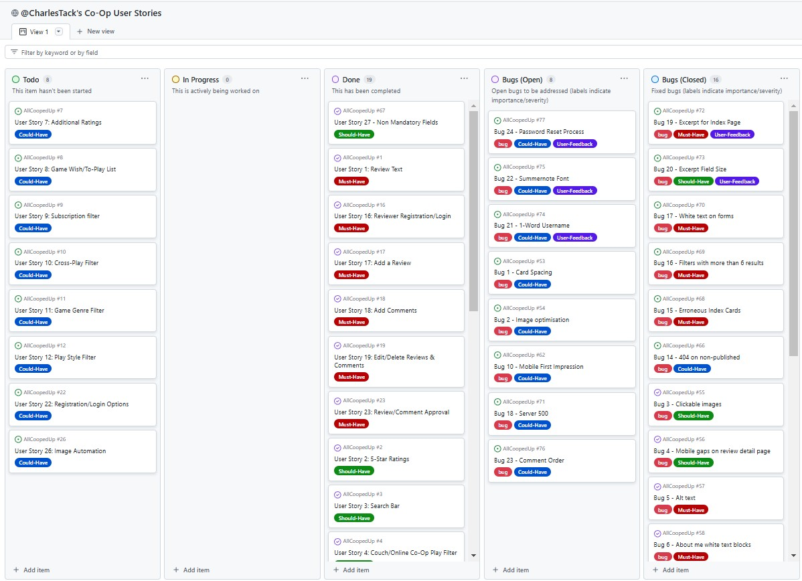
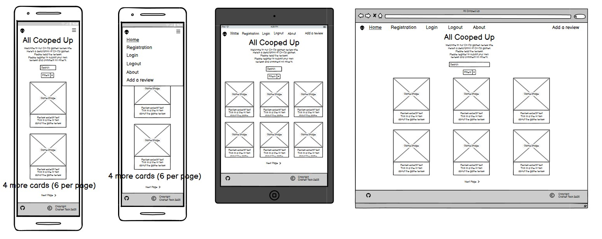
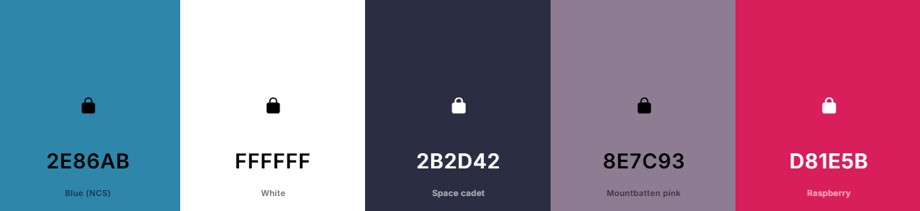

# AllCoopedUp
Full Stack Co-operative Video Game Review Site  

- Deployed project can be found [here](https://all-cooped-up-12274f373445.herokuapp.com/) (right-click to open in a new tab).

#### A note on the name
_"All Cooped Up"_ is play on words relating to the site's purpose being to review co-operatively played games.  It also harks back to Covid-19 lockdowns where there was an large increase in the numbers of people playing video games together online whilst they were "cooped up" at home. 

## User experience
### Purpose
- All Cooped Up is designed for lovers of co-op games.
- The site has been deployed with a selection of reviews, but users are encouraged to contribute their own reviews to help other users pick the best games to play.
- Filters are available and easy to use so that users can specify a number of factors to limit the number of reviews being presented to them.

## Agile methodology
- Agile methodology is "a set of methods and practices where solutions evolve through collaboration between self-organizing, cross-functional teams" ([reference](https://www.agilealliance.org/agile-essentials/)).
- A project board was set-up to keep track of user stories. Each user story was assigned a 'MoSCoW' prioritisation (must have, should have, could have, won't have) tag. The board can be found [here](https://github.com/users/CharlesTack/projects/16).
- The project board also includes columns for bugs which are open and those which have been closed.
An image of my project board taken late in development is below for reference:

### User stories
A total of 27 user stories were created and entered into the project board, categorised into Must-Have (8 stories), Should-Have (11 stories) and Could-Have (8 stories) and labelled appropriately. These were then sorted into To-Do, In Progress and Done columns and were moved through each column during the development.  The full board including all User Stories can be found [here](https://github.com/users/CharlesTack/projects/16).

I have included all of the "Must-Have" stories on a seperate User Stories page [here](static/readme/documents/userstories.md).  Below is a single example to demonstrate how the user stories are composed:

**User Story 14: Inclusivity**  
As a visually impaired user I would like all screens to have good contrast and all images to have alt descriptions so that I have a greater opportunity to be included.
_Acceptance Criteria:_
- The site’s colour scheme should pass contrast checking tests to ensure that it’s easy for all viewers to see.
- All images should have alt text for screen readers and for when images fail to load.
_Tasks:_
- Use appropriate tools to decide on a colour scheme and ensure that rigorous contrast checking is done in the testing stage.
- Use CSS variables to be able to quickly change colours to assist in making sure they have good contrast at the testing stage.
- Code the HTML to use something like: alt="Image of the box art for {{ game.title }}" so that the reviewer doesn’t have to stipulate the alt text manually.

## Design

### Wireframes

A full set of wireframes were created to display the design for each and every page in the site.

For example:  
## index.html:  

Screenshots of all wireframes are [here](static/readme/documents/wireframes.md)

### Colour Scheme

Consideration was given to using the colour schemes of video game consoles, such as green, black and white for Xbox, but a decision was taken to not lean towards any platform so that the site is impartial.  [coolors.co](https://coolors.co/) was used to find colours which complimented each other (by using the lock function) whilst being indicative of technology and gaming (and also not being the same as any palette used by the likes of PlayStation).  Once the palette had been selected, the colours were put into CSS variables to allow for quick changes which would be needed to ensure high contrast ratios.  The colours were adjusted slightly from their original shades at the contrast ratio testing stage.  The original palette is shown below:  

#### Colour palette

background-color: #2B2D42; (dark blue - was Space Cadet, now Black Violet)  
primary-color: #FFFFFF; (white used for text on darker colours)  
secondary-color: #2C7DA5; (bright blue - was Blue(NCS), now Prominent Blue)  
tertiary-color: #847089; (dark blush - was Mountbatten Pink, now Purple Grey)  
highlight-color: #D81E5B; (Bright Pink - was Raspberry, now Rose Rush)  
highlight-color-light: #F093B2; (Light Pink - was Amaranth Pink, now Illusion)  

### Typography

Note 8:
Include notes on where the fonts were sourced from and why each font was chosen.  Include examples of the fonts.

## Images

Note 9:
Enter details of where I sources the images from and a note regarding copyright.

## Features:

Note 10:
Enter details for each feature from the document you created.  Use tripe hash/sharp marks for the heading of each feature.  This can be done early as we know the features.

## Database

Note 11:
"I used Code Institute's PostgreSQL database"

### Database planning

Note 12:
Reference the ERD table/diagram and link an image of it.

### Creating a database

Note 13:
Provide a step by step guide to how I got the database URL (i.e. submitted the form and received the link via email)

## Deployment

Note 14:
Note the usage of Heroku and provide a link to the site.

### Heroku:

Note 15:
Provide some notes on Heroku along with a step by step guide on deployment.

### Cloning

Note 16:
Provide some notes and a step by step guide to cloning the repo via Github

### Forking

Note 17:
Provide some notes and a step by step guide to forking the repo via Github

## Technologies used

Note 18:
Provide a list of all technologies used in the production of the site

## The use of AI

Note 19:
Provide detail on the use of AI on the project to satisfy the learning objectives.

## Testing

Note 20:
Link to a separate testing file

## Future plans

Note 21:
Make a note of all of the "Could-Have" user stories which weren't delivered and how and when they might be applied.  Reference back to the agile tutorial for correct terminology.

## Credits

Note 22:
Credit every tool, site and reference I've used on the project

## Acknowledgements

Note 23:
Provide a list of people I'd like to personally thank.
NB. Remember to thank Richard and Emma.