# Testing

- Manual testing was carried out throughout the development of the website and bugs fixed as they arose. 

## Table of Contents:

- [Manual Testing](https://github.com/CharlesTack/AllCoopedUp/blob/main/static/readme/documents/testing.md#manual-testing)
- [HTML Code Validation](https://github.com/CharlesTack/AllCoopedUp/blob/main/static/readme/documents/testing.md#html)
- [CSS Code Validation](https://github.com/CharlesTack/AllCoopedUp/blob/main/static/readme/documents/testing.md#css)
- [JavaScript Code Validation](https://github.com/CharlesTack/AllCoopedUp/blob/main/static/readme/documents/testing.md#javascript)
- [Lighthouse](https://github.com/CharlesTack/AllCoopedUp/blob/main/static/readme/documents/testing.md#lighthouse)

## Manual testing
- Extensive manual testing was carried out on the local and deployed sites.  

| Location                 | Feature                                 | Expected Outcome                                                                                                                                                                                                                                                                                                                                                                                   | Pass/Fail | Notes                                                             |
| ------------------------ | --------------------------------------- | -------------------------------------------------------------------------------------------------------------------------------------------------------------------------------------------------------------------------------------------------------------------------------------------------------------------------------------------------------------------------------------------------- | --------- | ----------------------------------------------------------------- |
| index.html/navbar        | Logo button                             | On click takes user to index.html page                                                                                                                                                                                                                                                                                                                                                             | Pass      | Functions as expected                                             |
| index.html/navbar        | Home button                             | On click takes user to index.html page                                                                                                                                                                                                                                                                                                                                                             | Pass      | Functions as expected                                             |
| index.html/navbar        | Login button                            | On click takes user to login.html page                                                                                                                                                                                                                                                                                                                                                             | Pass      | Functions as expected                                             |
| index.html/navbar        | Logout button                           | On click takes user to logout.html page                                                                                                                                                                                                                                                                                                                                                            | Pass      | Functions as expected                                             |
| index.html/navbar        | Register button                         | On click takes user to signup.html page                                                                                                                                                                                                                                                                                                                                                            | Pass      | Functions as expected                                             |
| index.html/navbar        | About button                            | On click takes user to about.html page                                                                                                                                                                                                                                                                                                                                                             | Pass      | Functions as expected                                             |
| index.html/navbar        | Add a Review button                     | On click takes user to submit_review.html page                                                                                                                                                                                                                                                                                                                                                     | Pass      | Functions as expected                                             |
| index.html/navbar        | Burger Menu                             | On mobiles, navbar appears as collapsable burger menu with fully functioning links                                                                                                                                                                                                                                                                                                                 | Pass      | Functions as expected                                             |
| All pages                | Navbar                                  | Navbar is visible on all pages                                                                                                                                                                                                                                                                                                                                                                     | Pass      | Functions as expected                                             |
| All pages                | Footer                                  | Footer is visible on all pages                                                                                                                                                                                                                                                                                                                                                                     | Pass      | Functions as expected                                             |
| All pages                | Login status                            | User can see their logged in status towards top right of each screen, which includes username                                                                                                                                                                                                                                                                                                      | Pass      | Functions as expected                                             |
| login.html               | Sign Up Link                            | On click takes user to signup.html page                                                                                                                                                                                                                                                                                                                                                            | Pass      | Functions as expected                                             |
| login.html               | Username field                          | On correct username entry is accepted                                                                                                                                                                                                                                                                                                                                                              | Pass      | Functions as expected                                             |
| login.html               | Username field                          | On incorrect username entry is rejected                                                                                                                                                                                                                                                                                                                                                            | Pass      | Functions as expected                                             |
| login.html               | Password field                          | On correct password entry is accepted                                                                                                                                                                                                                                                                                                                                                              | Pass      | Functions as expected                                             |
| login.html               | Password field                          | On incorrect password entry is rejected                                                                                                                                                                                                                                                                                                                                                            | Pass      | Functions as expected                                             |
| login.html               | Username field                          | On missing entry user is alerted                                                                                                                                                                                                                                                                                                                                                                   | Pass      | Functions as expected                                             |
| login.html               | Password field                          | On missing entry user is alerted                                                                                                                                                                                                                                                                                                                                                                   | Pass      | Functions as expected                                             |
| login.html               | Forgot password link                    | On click takes user to password_reset.html page                                                                                                                                                                                                                                                                                                                                                    | Pass      | Functions as expected                                             |
| login.html               | Collaborate form link                   | On click takes user to the Collaborate form on the about.html page                                                                                                                                                                                                                                                                                                                                 | Pass      | Functions as expected                                             |
| login.html               | Sign In button                          | On click logs user in, returns them to the index.html page with a confirmation message and the login status is updated                                                                                                                                                                                                                                                                             | Pass      | Functions as expected                                             |
| signup.html              | Sign In Link                            | On click takes user to login.html page                                                                                                                                                                                                                                                                                                                                                             | Pass      | Functions as expected                                             |
| signup.html              | Username field                          | On compliant username input is accepted                                                                                                                                                                                                                                                                                                                                                            | Pass      | Functions as expected                                             |
| signup.html              | Username field                          | On non-compliant username (e.g. includes as space) user is alerted and input is rejected                                                                                                                                                                                                                                                                                                           | Pass      | Functions as expected                                             |
| signup.html              | Username field                          | On profane usernames are rejected and the user is alerted                                                                                                                                                                                                                                                                                                                                          | Fail      | Needs to be coded (Bug 28)                                        |
| signup.html              | Username field                          | On missing entry user is alerted                                                                                                                                                                                                                                                                                                                                                                   | Pass      | Functions as expected                                             |
| signup.html              | Username field                          | On submission of username which already exists user is alerted and submission is rejected                                                                                                                                                                                                                                                                                                          | Pass      | Functions as expected                                             |
| signup.html              | Username field                          | On submission of a username which includes spaces, the user is alerted that spaces are specifically not permitted.                                                                                                                                                                                                                                                                                 | Fail      | Message needs to be amended (Bug 21)                              |
| signup.html              | Email field                             | Email is optional and form is accepted without field completion                                                                                                                                                                                                                                                                                                                                    | Pass      | Functions as expected                                             |
| signup.html              | Password field                          | On missing entry user is alerted                                                                                                                                                                                                                                                                                                                                                                   | Pass      | Functions as expected                                             |
| signup.html              | Password field                          | On non-matching entry with Password (again) entry user is alerted and submission is rejected                                                                                                                                                                                                                                                                                                       | Pass      | Functions as expected                                             |
| signup.html              | Password (again) field                  | On non-matching entry with Password entry user is alerted and submission is rejected                                                                                                                                                                                                                                                                                                               | Pass      | Functions as expected                                             |
| signup.html              | Password field                          | On submission of password which is too similar to username user is alerted and submission is rejected                                                                                                                                                                                                                                                                                              | Pass      | Functions as expected                                             |
| signup.html              | Password field                          | On submission of password which is too short user is alerted and submission is rejected                                                                                                                                                                                                                                                                                                            | Pass      | Functions as expected                                             |
| signup.html              | Password field                          | On submission of password which is too common user is alerted and submission is rejected                                                                                                                                                                                                                                                                                                           | Pass      | Functions as expected                                             |
| signup.html              | Password field                          | On submission of password which is entirely numeric user is alerted and submission is rejected                                                                                                                                                                                                                                                                                                     | Pass      | Functions as expected                                             |
| signup.html              | Submit button                           | On validated submission the form is accepted, the user is logged in and returned to the index.html page with a confirmation message visible at the top of the screen                                                                                                                                                                                                                               | Pass      | Functions as expected                                             |
| logout.html              | Sign Out button                         | On click logs user out, returns them to index.html with a confirmation message and the login status is updated                                                                                                                                                                                                                                                                                     | Pass      | Functions as expected                                             |
| password_reset.html      | Reset My Password button                | On entry of valid user email address and on click of Reset My Password button, user receives email confirming password reset process                                                                                                                                                                                                                                                               | Fail      | Returns Server Error (500) (Bugs 24 and 29)                       |
| password_reset.html      | Collaborate form link                   | On click takes user to the Collaborate form on the about.html page                                                                                                                                                                                                                                                                                                                                 | Pass      | Functions as expected                                             |
| index.html/body          | Register Link                           | Logged out user: On click, the register link beneath the welcome message takes the user to the signup.html page.                                                                                                                                                                                                                                                                                   | Pass      | Functions as expected                                             |
| index.html/body          | Register Link                           | Logged in user: On click, the register link beneath the welcome message maintains the user's position on the index.html page                                                                                                                                                                                                                                                                       | Pass      | Functions as expected                                             |
| index.html/body          | Log In Link                             | Logged out user: On click, the log in link beneath the welcome message takes the user to the login.html page.                                                                                                                                                                                                                                                                                      | Pass      | Functions as expected                                             |
| index.html/body          | Log In Link                             | Logged in user: On click, the log in link beneath the welcome message maintains the user's position on the index.html page                                                                                                                                                                                                                                                                         | Pass      | Functions as expected                                             |
| index.html/body          | Submit link                             | Logged out user: On click, the submit link beneath the welcome message takes the user to the login.html page, and onwards to the submit_review.html once signed in                                                                                                                                                                                                                                 | Pass      | Functions as expected                                             |
| index.html/body          | Submit link                             | Logged in user: On click, the submit link beneath the welcome message takes the user to the submit_review.html page                                                                                                                                                                                                                                                                                | Pass      | Functions as expected                                             |
| index.html/body          | Search Bar                              | Matching results: When the name or part of the name of a game is entered (regardless of case) the visible game review cards are updated with matching results                                                                                                                                                                                                                                      | Pass      | Functions as expected                                             |
| index.html/body          | Search Bar                              | No matching results: If no matching results are available, the user is alerted and provided with a link to submit a review                                                                                                                                                                                                                                                                         | Pass      | Functions as expected                                             |
| index.html/body          | Submit Your Own Review link             | Logged out user: On click, the submit link in the alert message takes the user to the login.html page, and onwards to the submit_review.html once signed in                                                                                                                                                                                                                                        | Pass      | Functions as expected                                             |
| index.html/body          | Submit Your Own Review link             | Logged in user: On click, the submit link in the alert message takes the user to the submit_review.html page                                                                                                                                                                                                                                                                                       | Pass      | Functions as expected                                             |
| index.html/body          | Platforms Filter                        | When clicked (and the Filter button is pressed) the user is given a drop-down menu of platform options which reduces updates the visible review cards on the index.html page and all subsequent pages                                                                                                                                                                                              | Pass      | Functions as expected                                             |
| index.html/body          | PEGI Rating Filter                      | When clicked (and the Filter button is pressed) the user is given a drop-down menu of PEGI Rating options which reduces updates the visible review cards on the index.html page and all subsequent pages                                                                                                                                                                                           | Pass      | Functions as expected                                             |
| index.html/body          | Couch Co-Op Filter                      | When clicked (and the Filter button is pressed) the review cards on the index.html page and all subsequent pages are updated to only include those games with a couch co-op mode                                                                                                                                                                                                                   | Pass      | Functions as expected                                             |
| index.html/body          | Online Filter                           | When clicked (and the Filter button is pressed) the review cards on the index.html page and all subsequent pages are updated to only include those games with an online co-op mode                                                                                                                                                                                                                 | Pass      | Functions as expected                                             |
| index.html/body          | Filter Button                           | When filter options are selected, on click the user is presented with a view of game review cards which match the selected filters                                                                                                                                                                                                                                                                 | Pass      | Functions as expected                                             |
| index.html/body          | Clear Filters Button                    | When clicked, the filters are removed and the user is returned to the index.html page                                                                                                                                                                                                                                                                                                              | Pass      | Functions as expected                                             |
| index.html/body          | Card Image                              | When clicked the user is taken to the detailed_review.html page of the respective game                                                                                                                                                                                                                                                                                                             | Pass      | Functions as expected                                             |
| index.html/body          | Card Game Title                         | When clicked the user is taken to the detailed_review.html page of the respective game                                                                                                                                                                                                                                                                                                             | Pass      | Functions as expected                                             |
| index.html/body          | Next button                             | Button only appears when there are more than 6 review cards being filtered and visible on screen.  When clicked takes user to subsequent page                                                                                                                                                                                                                                                      | Pass      | Functions as expected                                             |
| index.html/body          | Prev button                             | Button only appears when there are more than 6 review cards being filtered and visible on screen if the user is already on at least the 2nd page.  When clicked takes user to the sequentially previous page                                                                                                                                                                                       | Pass      | Functions as expected                                             |
| index.html/body          | Card Spacing                            | The cards are of equal size regardless of the dimensions of the original uploaded image                                                                                                                                                                                                                                                                                                            | Fail      | Needs to be coded (Bug 1)                                         |
| index.html/footer        | Github link                             | When clicked the user is taken to external Github profile page in new tab                                                                                                                                                                                                                                                                                                                          | Pass      | Functions as expected                                             |
| index.html/footer        | LinkedIn link                           | When clicked the user is taken to external LinkedIn profile page in new tab                                                                                                                                                                                                                                                                                                                        | Pass      | Functions as expected                                             |
| index.html/footer        | YouTube link                            | When clicked the user is taken to external YouTube profile page in new tab                                                                                                                                                                                                                                                                                                                         | Pass      | Functions as expected                                             |
| index.html               | Mobile View                             | When viewed on a mobile, the first sight of the index page should include an image rather than being mainly text (navbar, welcome message and search/filters section)                                                                                                                                                                                                                              | Fail      | Needs to be coded (Bug 10)                                        |
| detailed_review.html     | Add comment (submit)                    | When a user enters a comment beneath the main review and clicks the submit button, the comment is accepted and the user receives a message confirming that it is pending approval                                                                                                                                                                                                                  | Pass      | Functions as expected                                             |
| detailed_review.html     | Add comment (pending)                   | When the user has a comment which is pending admin approval, they are informed via a message using a different font colour beside their comment and is presented with Edit and Delete buttons                                                                                                                                                                                                      | Pass      | Functions as expected                                             |
| detailed_review.html     | Add comment (pending)                   | When the comment creator is logged out the pending comment and Edit/Delete buttons are not visible                                                                                                                                                                                                                                                                                                 | Pass      | Functions as expected                                             |
| detailed_review.html     | Edit comment                            | When the comment creator clicks the Edit button, their comment is reloaded into the comment form and the Submit button becomes an Update button.  Once the user has edited their comment, on clicking the Update button their pending comment is updated and remains pending approval.  A message is provided to the user confirming the update                                                    | Pass      | Functions as expected                                             |
| detailed_review.html     | Delete comment                          | Regardless of whether the comment has been approved by the admin, the comment creator can click on the delete Button beneath their comment.  On clicking the Delete button the user is asked to confirm their request for comment deletion.  On clicking the 2nd delete button the user gets a confirmation message.  If the user clicks either the Close button or the X, the deletion is aborted | Pass      | Functions as expected                                             |
| detailed_review.html     | Banner/Masthead Image                   | Image is displayed consistently showing the most appropriate part of the uploaded image.                                                                                                                                                                                                                                                                                                           | Fail      | Needs to be coded (Bug 2)                                         |
| detailed_review.html     | Comment Order                           | Comments should be ordered by date/time of receipt/publishing                                                                                                                                                                                                                                                                                                                                      | Fail      | Needs to be coded (Bug 23)                                        |
| submit_review.html       | Game title field                        | The field is mandatory.  The user can enter a game title up to 100 characters and is alerted on submission if the game review already exists                                                                                                                                                                                                                                                       | Pass      | Functions as expected                                             |
| submit_review.html       | Review title field                      | The field is mandatory.  The user can enter a review title up to 200 characters                                                                                                                                                                                                                                                                                                                    | Pass      | Functions as expected                                             |
| submit_review.html       | Platform Played on dropdown menu        | The field is mandatory.  The user can select which platform they played the game on from 4 options, Xbox, PlayStation, Nintendo and PC.  The field defaults to Xbox                                                                                                                                                                                                                                | Pass      | Functions as expected                                             |
| submit_review.html       | Index Excerpt field                     | The field is mandatory.  The user can enter a one line teaser/comment                                                                                                                                                                                                                                                                                                                              | Pass      | Functions as expected                                             |
| submit_review.html       | Star rating dropdown menu               | The field is mandatory.  The user can select a star rating from 5 options.  The field defaults to 1 Star                                                                                                                                                                                                                                                                                           | Pass      | Functions as expected                                             |
| submit_review.html       | Couch Co-Op Radio                       | The field is optional.  User can click the radio to confirm whether the game has a couch co-op feature                                                                                                                                                                                                                                                                                             | Pass      | Functions as expected                                             |
| submit_review.html       | Online Co-Op Radio                      | The field is optional.  User can click the radio to confirm whether the game has a online co-op feature                                                                                                                                                                                                                                                                                            | Pass      | Functions as expected                                             |
| submit_review.html       | PEGI Rating dropdown menu               | The field is optional.  User can select a PEGI rating from 5 options.  The field defaults to null                                                                                                                                                                                                                                                                                                  | Pass      | Functions as expected                                             |
| submit_review.html       | Platform availability Xbox radio        | The field is optional.  User can click the radio to confirm whether the game is available on Xbox                                                                                                                                                                                                                                                                                                  | Pass      | Functions as expected                                             |
| submit_review.html       | Platform availability PlayStation radio | The field is optional.  User can click the radio to confirm whether the game is available on PlayStation                                                                                                                                                                                                                                                                                           | Pass      | Functions as expected                                             |
| submit_review.html       | Platform availability Nintendo radio    | The field is optional.  User can click the radio to confirm whether the game is available on Nintendo                                                                                                                                                                                                                                                                                              | Pass      | Functions as expected                                             |
| submit_review.html       | Platform availability PC radio          | The field is optional.  User can click the radio to confirm whether the game is available on PC                                                                                                                                                                                                                                                                                                    | Pass      | Functions as expected                                             |
| submit_review.html       | Image Upload                            | The field is optional.  User can click the Choose File button, select an image and upload it for inclusion with their review.  If no image is loaded a default placeholder image is presented on the detailed_review.html page.                                                                                                                                                                    | Pass      | Functions as expected                                             |
| submit_review.html       | Full review field                       | The field is mandatory.  The user can enter review text                                                                                                                                                                                                                                                                                                                                            | Pass      | Functions as expected                                             |
| submit_review.html       | Full review field                       | If the user changes the font of the text in the full review field, their choice is suppressed and the default site font is used on the detailed_review.html page                                                                                                                                                                                                                                   | Fail      | Summernote font is seen on the detailed_review.html page (Bug 22) |
| submit_review.html       | Submit button                           | Upon entering at least all mandatory fields the review is submitted and a confirmation message regarding requirement for approval is seen.  If any mandatory field is missing or if a review for the game exists already, the user is alerted.                                                                                                                                                     | Pass      | Functions as expected                                             |
| submit_review.html       | Wikipedia Link                          | When the link is clicked it takes the user to the Wikipedia home page in a new tab                                                                                                                                                                                                                                                                                                                 | Pass      | Functions as expected                                             |
| submit_review.html       | Copyright Example Link                  | When the link is clicked it takes the user to the Wikipedia page regarding the usage of copyright in the Minecraft box art image in a new tab                                                                                                                                                                                                                                                      | Pass      | Functions as expected                                             |
| about.html/collaboration | Name field                              | This field is mandatory.  The user can enter their name                                                                                                                                                                                                                                                                                                                                            | Pass      | Functions as expected                                             |
| about.html/collaboration | Email field                             | This field is mandatory.  The user can enter their email address                                                                                                                                                                                                                                                                                                                                   | Pass      | Functions as expected                                             |
| about.html/collaboration | Message field                           | This field is mandatory.  The user can enter their message                                                                                                                                                                                                                                                                                                                                         | Pass      | Functions as expected                                             |
| about.html/collaboration | Submit button                           | When clicked the user receives confirmation that their message has been received and a note on expected response times.  If any field has failed validation the user is alerted                                                                                                                                                                                                                    | Pass      | Functions as expected                                             |
| about.html               | Wikipedia Link                          | When the link is clicked it takes the user to the Wikipedia home page in a new tab                                                                                                                                                                                                                                                                                                                 | Pass      | Functions as expected                                             |
| about.html               | Copyright Example Link                  | When the link is clicked it takes the user to the Wikipedia page regarding the usage of copyright in the Minecraft box art image in a new tab                                                                                                                                                                                                                                                      | Pass      | Functions as expected                                             |
| Full site                | Intermittent Server 500 Errors          | The site should be free of intermittent Server 500 errors                                                                                                                                                                                                                                                                                                                                          | Fail      | Requires investigation (Bug 18)                                   |  

**Back to the [table of contents](https://github.com/CharlesTack/AllCoopedUp/blob/main/static/readme/documents/testing.md#table-of-contents)**

## Code validators
### HTML
- The [W3C Validator](https://validator.w3.org/) was used to validate the HTML.  

#### index.html
Returned 7 “Info” alerts re trailing slashes, but no errors.
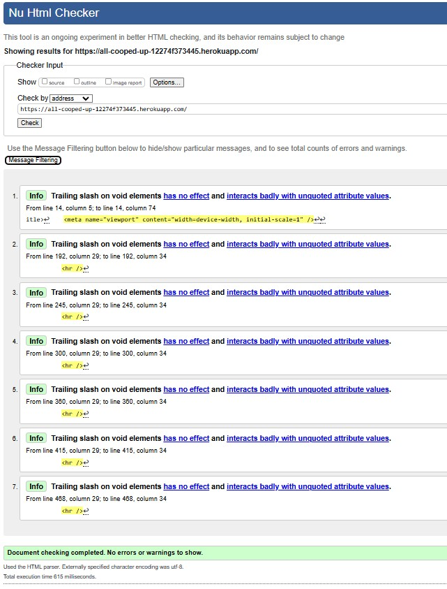  

#### review_detail.html
**Test 1:** Tested Goat Simulator page which returned 25 warnings, most of which were errors such as “Error: Element o:p not allowed as child of element p in this context”.  I initially thought that this might be caused by Copilot sourced text containing rich-text elements which could be causing conflicts with CSS (as another of the errors mentioned Times New Roman), so I fixed this by editing the review text in Admin (cutting the text and pasting it back as plain text).  I repeated this for all reviews on the database.  I now believe that this is an issue caused by Summernote itself, though I have no hard evidence of that.  Once the fix was applied I retested.  
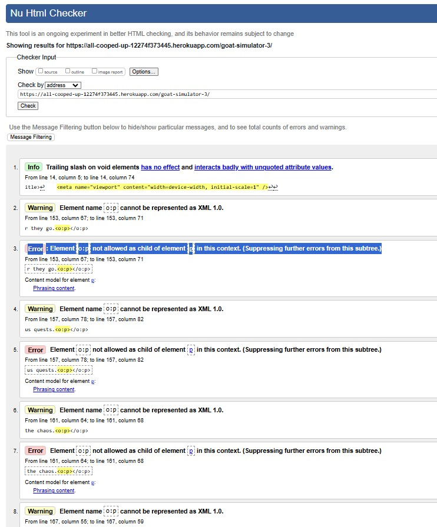  

**Test 2:** Returned 4 alerts, of which 2 were errors.  
- Error: End tag main seen, but there were open elements  
- Error: Unclosed element div  
Presuming these are the same issue which is caused by an unclosed div element which should be on row 92 of my code.  Fixed that, which has now caused a further issue with the layout of the comments section being affected.  Moved the closing div tag to below the “Comments” and “Add a comment” sections to fix the layout.  
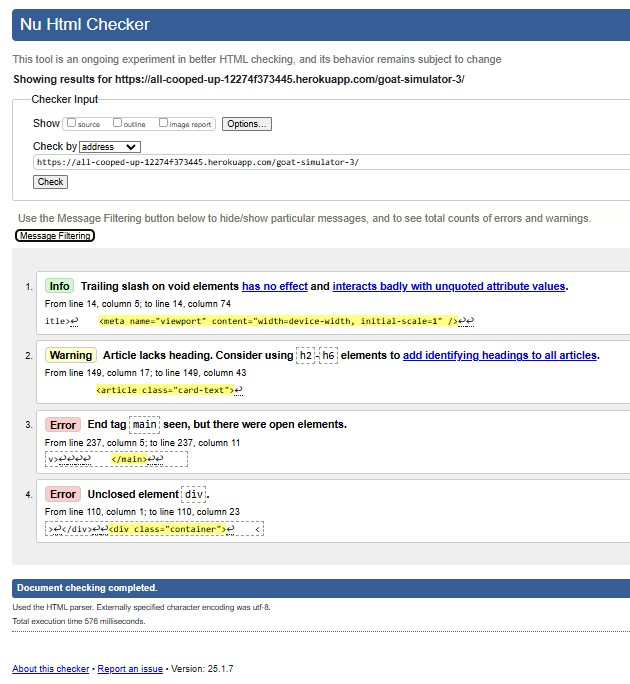  

**Test 3:** Returned 1 “Info” (re trailing slash) and 1 “Warning” (re article lacking heading) alert, but no errors.  
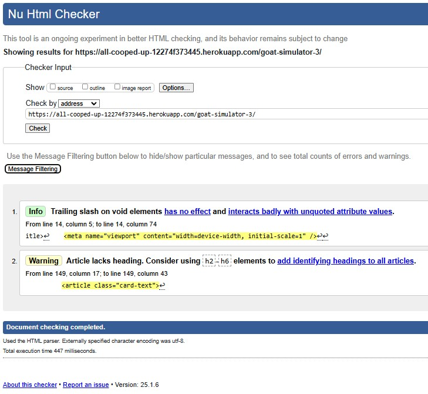  

**Test 4:** Tested a review page with a logged in user and a user generated comment via copying page source from browser.  Returned the same 2 alerts as Test 3.  
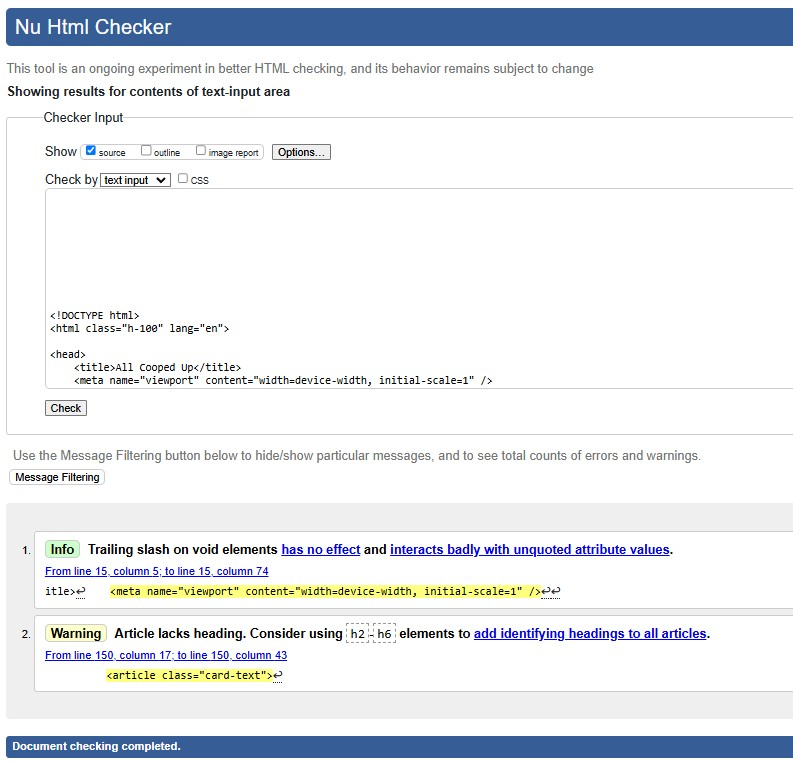

#### submit_review.html
Returned 2 “Info” alerts (re trailing slashes) and no errors.  
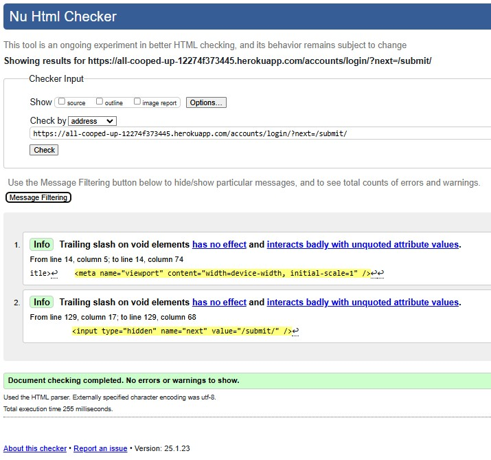  

#### about.html
**Test 1:** Returned 28 alerts of which 14 were errors.  Same issue as the review_detail.html errors, so likely caused by Summernote.
Copied and pasted the “about me” text back into Summernote as plain text and retested.  
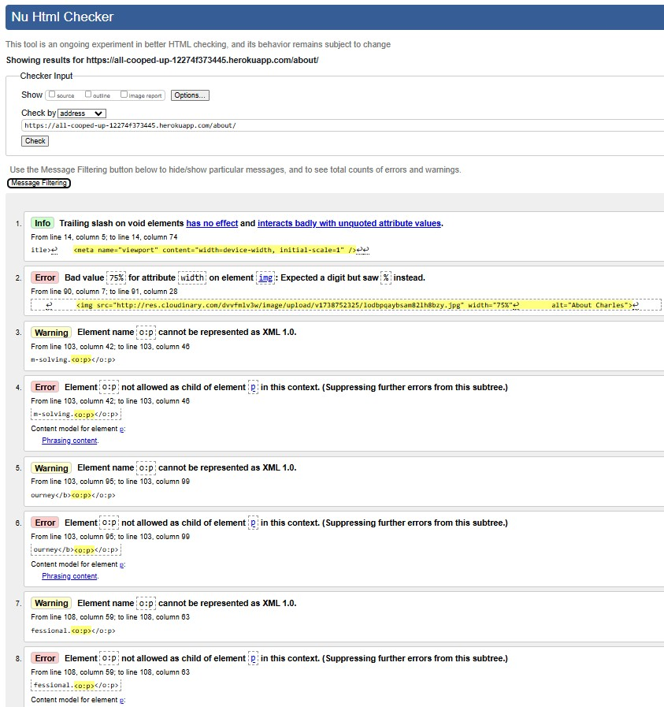  

**Test 2:** Returned 1 errors regarding the use of ‘width = “75%”’ on the profile image.  Tried to use CSS class to fix this, but it didn’t work.  Used inline CSS to apply the CSS ‘style=“width: 75%;”’ code, which has fixed it.  
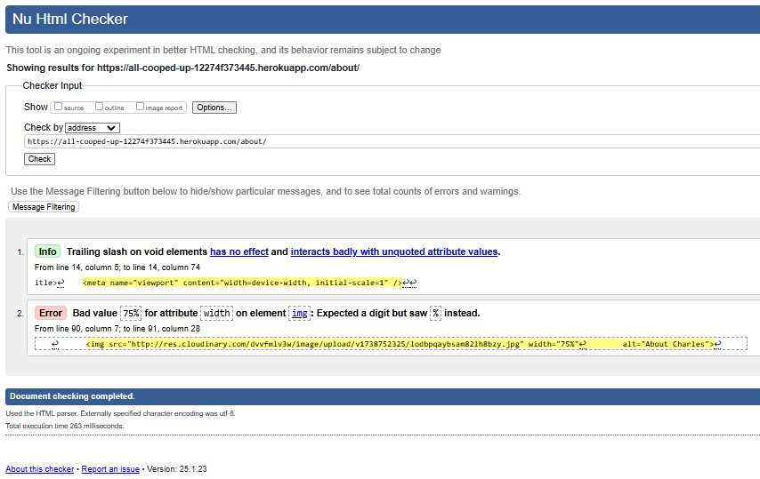  

**Test 3:** Returned 1 “Info” alert (re trailing slash) and no errors.  
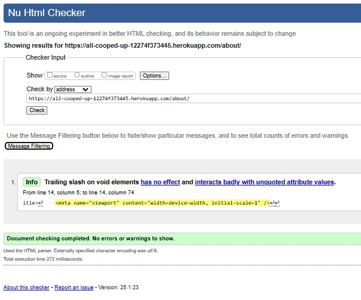  

#### login.html
Returned 1 “Info” alert (re trailing slash) and no errors.  
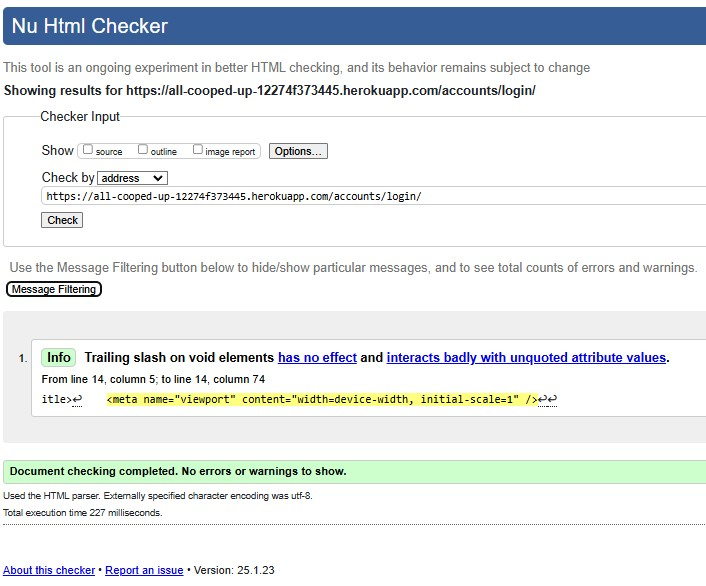

#### logout.html
Presumed test via source code needed as login was required.  Returned 1 “Info” alert (re trailing slash) and no errors.  
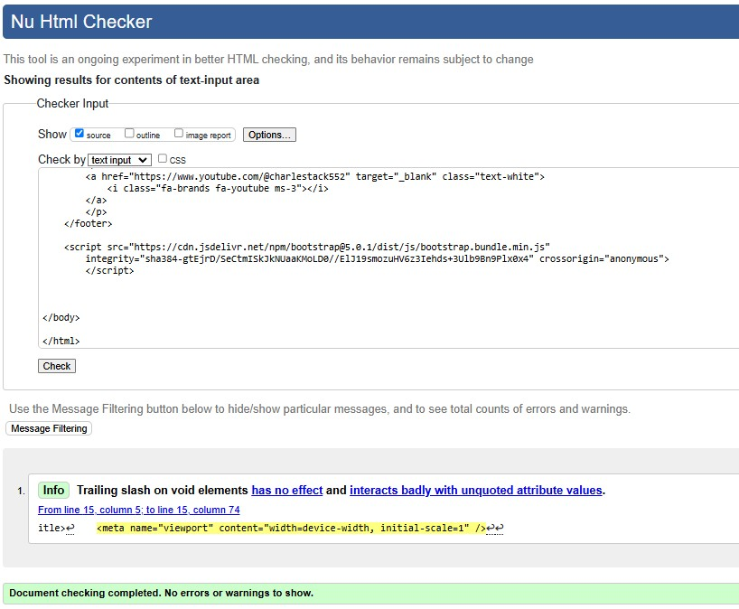  

#### signup.html
Returned 5 alerts which were 1 info, and 4 errors.  
- Error End tag p implied, but there were open elements.
- Error Unclosed element span.
- Error Stray end tag span.
- Error No p element in scope but a p end tag seen.  
As the errors are all from rows 124 and 127, I must presume that they come from code generated by the Django template as my own signup.html code only runs to row 38 (having reviewed the page source I can confirm this to be true).  As the code exists in a deeper level of Django than I’m capable of accessing to fix the errors, I will concede that these will be unfixed.  
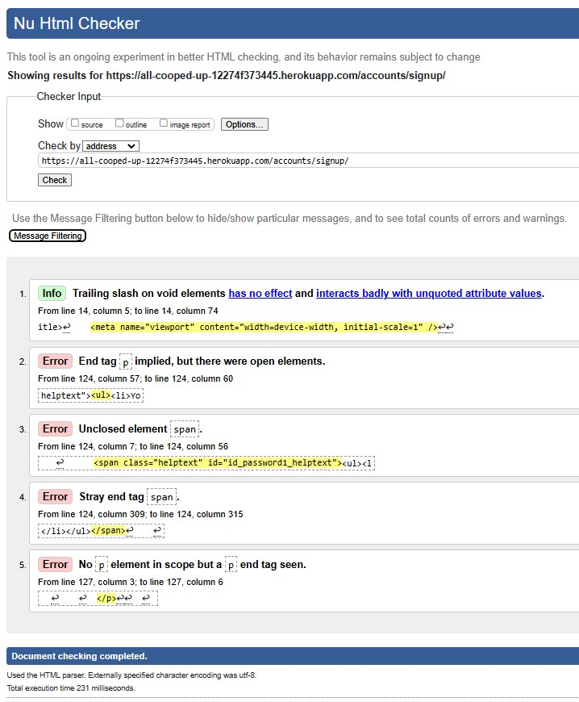  

#### password_reset.html
Returned 1 “Info” alert (re trailing slash) and no errors.  
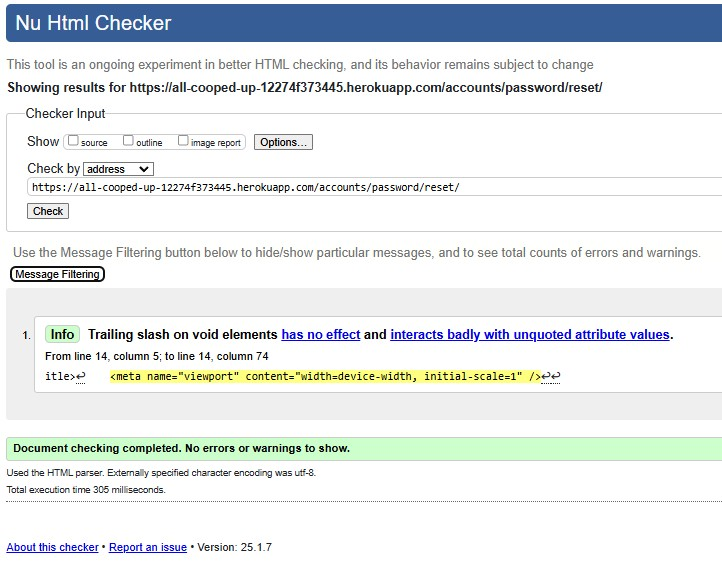  

**Back to the [table of contents](https://github.com/CharlesTack/AllCoopedUp/blob/main/static/readme/documents/testing.md#table-of-contents)**

### CSS
- The [W3C CSS Validator](https://jigsaw.w3.org/css-validator/) was used to validate the CSS.  

I copied and pasted my style.css code into the “By direct input” field and the check came back free of errors.  
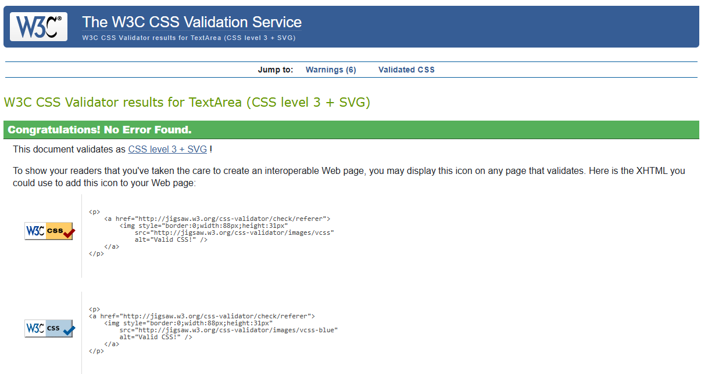  

**Back to the [table of contents](https://github.com/CharlesTack/AllCoopedUp/blob/main/static/readme/documents/testing.md#table-of-contents)**

### Javascript
- The [JSHint Validator](https://jshint.com/) was used to validate the JavaScript.  

I pasted my only JavaScript code from the “review_detail.js” file into the checker and it came back with 35 warnings regarding ES6, but no errors.  
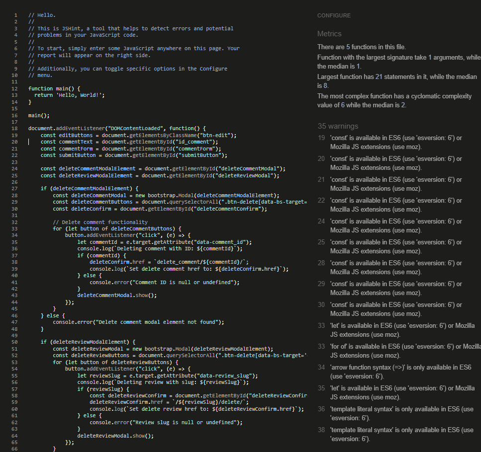

**Back to the [table of contents](https://github.com/CharlesTack/AllCoopedUp/blob/main/static/readme/documents/testing.md#table-of-contents)**

### Lighthouse
- The [Lighthouse](https://developer.chrome.com/docs/lighthouse) within the Chrome Dev Tools to check performance, accessibility and Best Practices.  I tested each page first in mobile and then in desktop device mode.

#### Table of Lighthouse Results:

| Page                | Device  | Performance | Accessibility | Best Practices |
| ------------------- | ------- | ----------- | ------------- | -------------- |
| index.html          | Mobile  | 77          | 100           | 57             |
| index.html          | Desktop | 99          | 100           | 56             |
| review_detail.html  | Mobile  | 91          | 100           | 57             |
| review_detail.html  | Desktop | 99          | 100           | 56             |
| submit_review.html  | Mobile  | 85          | 92            | 96             |
| submit_review.html  | Desktop | 98          | 92            | 100            |
| about.html          | Mobile  | 99          | 96            | 59             |
| about.html          | Desktop | 100         | 96            | 59             |
| logout.html         | Mobile  | 94          | 100           | 96             |
| logout.html         | Desktop | 97          | 100           | 100            |
| login.html          | Mobile  | 88          | 86            | 96             |
| login.html          | Desktop | 97          | 92            | 100            |
| signup.html         | Mobile  | 86          | 96            | 96             |
| signup.html         | Desktop | 100         | 96            | 100            |
| password_reset.html | Mobile  | 97          | 95            | 96             |
| password_reset.html | Desktop | 99          | 96            | 100            |

#### Individual Test Results:

**Test 1:** index.html (MOBILE)
- Performance: 74.  Suggestions for improvement are to use modern image file types.
- Accessibility: 92.  Suggestions for improvement are to give discernible names to links and select elements.
- Best Practices 57. Mostly issues around use of Cloudinary.  I can focus on improving the performance and accessibility figures as I can have little impact on the Best Practices one.  Converted all images to WebP and added discernible names to links and select elements.  

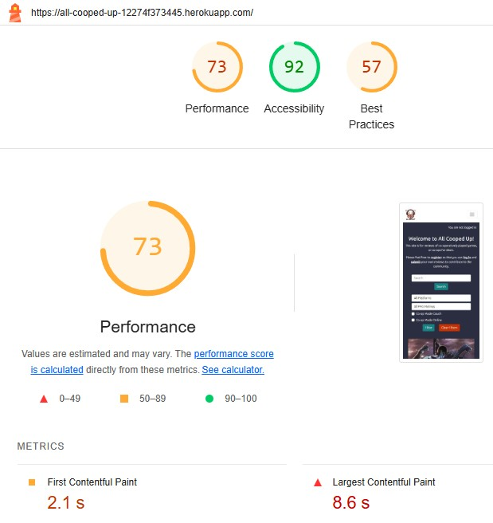

**Test 2 (post-fix):** index.html (MOBILE)
- Performance 77.  Even with the image files converted and now tiny (largest file is now 52k) I can’t get this higher than 77 mostly due to the lost potential savings (980ms) from using Font Awesome, Bootstrap, Heroku and Google Fonts.
- Accessibility 100.  Adding the aria-labels returned a perfect score.
- Best Practices 57. Cannot be improved.  

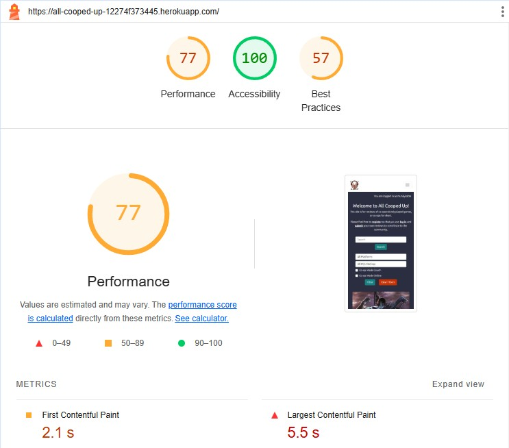

**Test 3:** index.html (DESKTOP)
- Performance 99.
- Accessibility 100.
- Best Practices 56.  

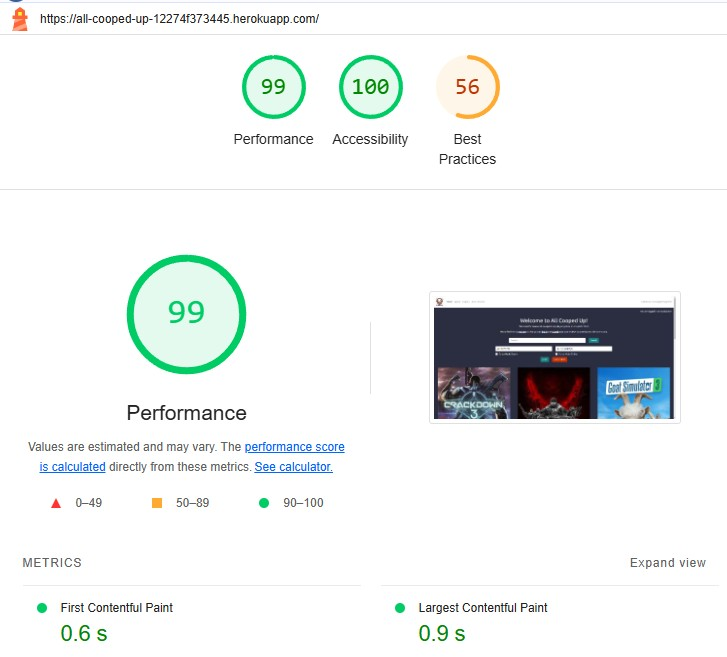

**Test 4:** review_detail.html(MOBILE)
- Performance 92.  Happy with performance, especially as this is mobile.
- Accessibility 98.  Accessibility score can be improved by changing a heading from h3 to h2.
- Best Practices 57.  

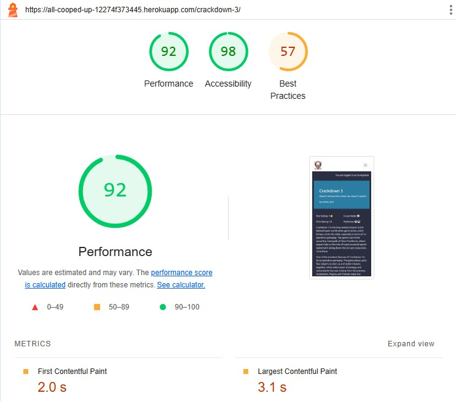

**Test 5 (post-fix):** review_detail.html(MOBILE)
- Performance 91.
- Accessibility 100.
- Best Practices 57.  

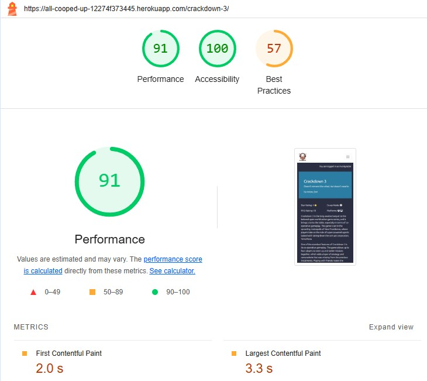

**Test 6:** review_detail.html(DESKTOP)
- Performance 99.
- Accessibility 100.
- Best Practices 56.  

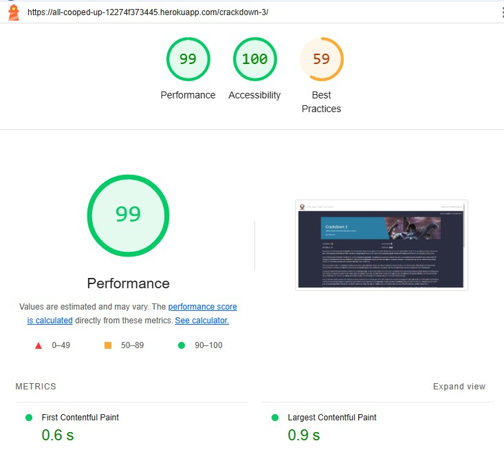

**Test 7:** submit_review.html(MOBILE)
- Performance 85.  Seems to be being caused by the same sources which were causing issues in the index.html page, so cannot be resolved.
- Accessibility 92.  Unfortunately on this occasion the score cannot be improved either.  It states that there is insufficient contrast ratio between the background and foreground colours, but as I have already fully tested this in a separate contrast checker, I am confident that the contrast ratio is more than acceptable.  The other potential correction is around the frame or iframe element not having a title, but as this is associated with the Summernote widget I cannot impact it.
- Best Practices 96.  

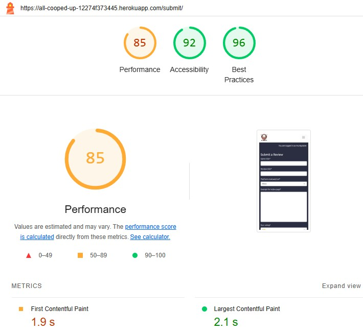

**Test 8:** submit_review.html(DESKTOP)
- Performance 98.
- Accessibility 92.
- Best Practices 100.  

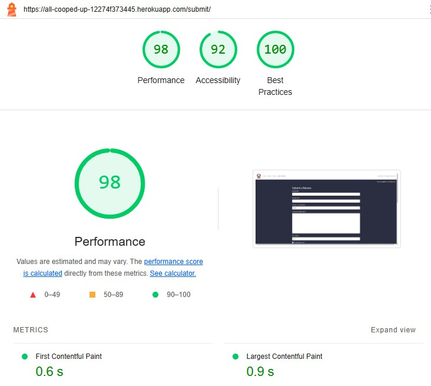

**Test 9:** about.html(MOBILE)
- Performance 68.  Mainly impacted by the size of my profile image.  Will resize to improve score.
- Accessibility 95.  Caused by contrast ratio again.
- Best Practices 57.  
(Apologies - screenshot missing)

**Test 10 (post-fix):** about.html(MOBILE)
- Performance 99.
- Accessibility 96.
- Best Practices 59.  

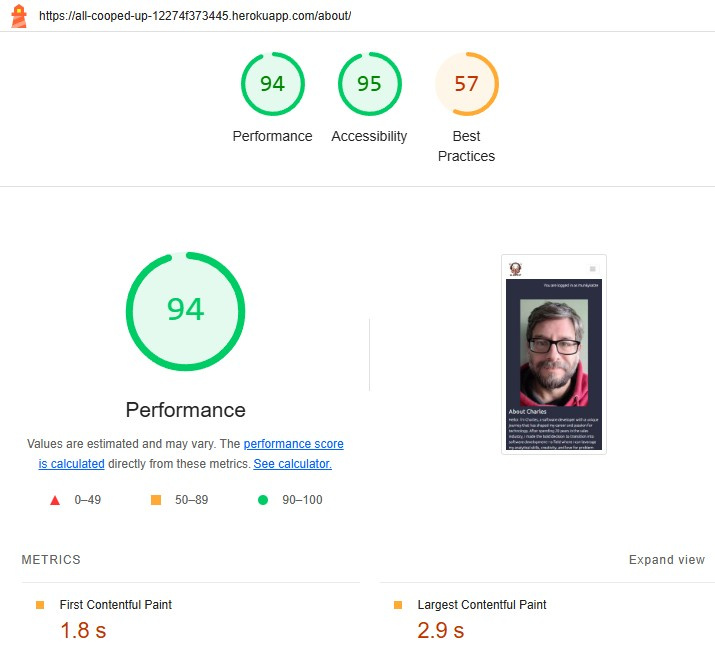

**Test 11:** about.html(DESKTOP).
- Performance 100.
- Accessibility 96.
- Best Practices 59.  

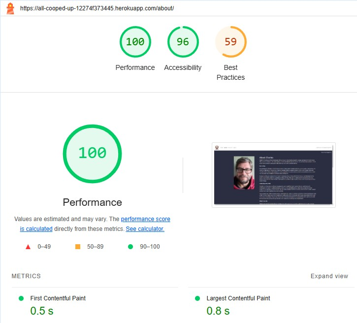

**Test 12:** logout.html(MOBILE).
- Performance 94.
- Accessibility 100.
- Best Practices 96.  

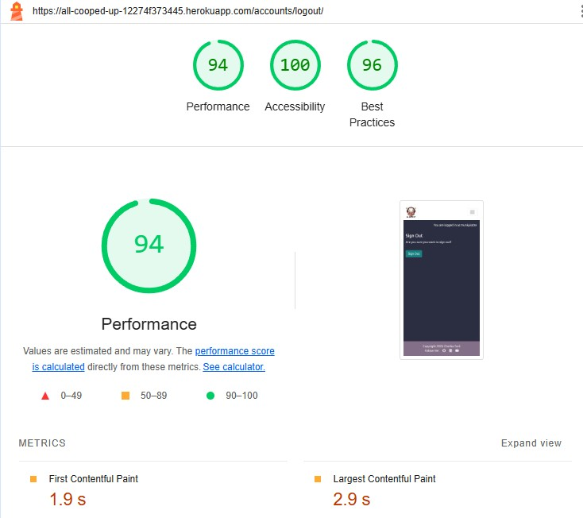

**Test 13:** logout.html(DESKTOP).
- Performance 97.
- Accessibility 100.
- Best Practices 100.  

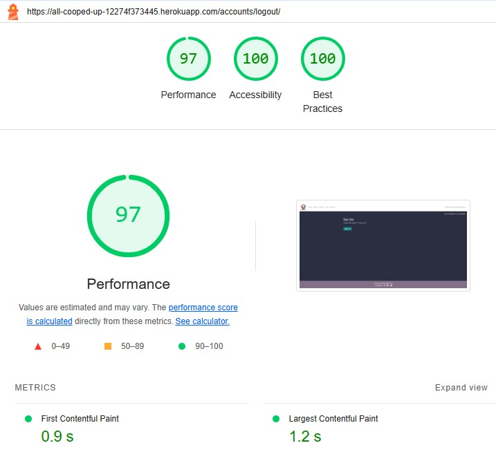

**Test 14:** login.html(MOBILE).
- Performance 88.  Dropped points mainly from causes seen in Test 1.
- Accessibility 86.  Due to contrast ratio, as mentioned in Test 7.
- Best Practices 96.  

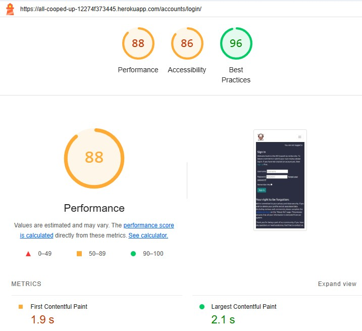

**Test 15:** login.html(DESKTOP).
- Performance 97.
- Accessibility 92.
- Best Practices 100.  

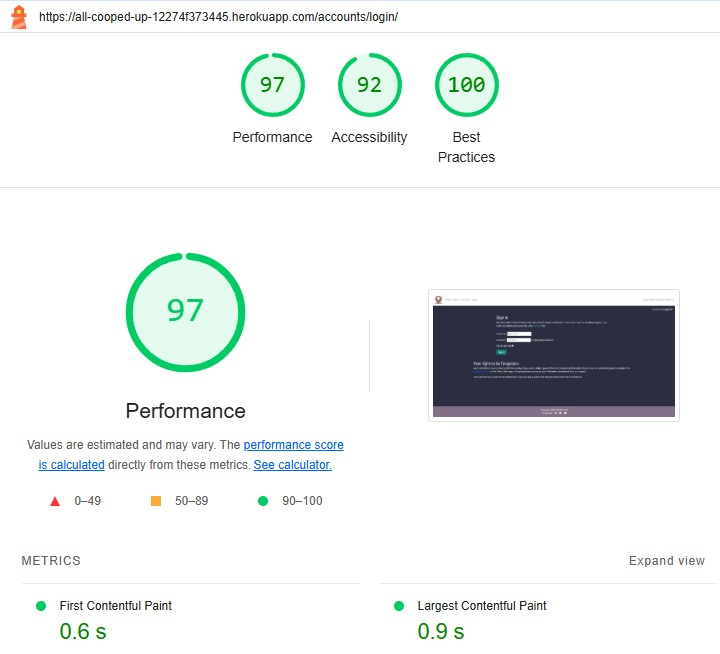

**Test 16:** signup.html(MOBILE).
- Performance 86.  Dropped points mainly from causes seen in Test 1.
- Accessibility 96.  Due to contrast ratio, as mentioned in Test 7.
- Best Practices 96.  

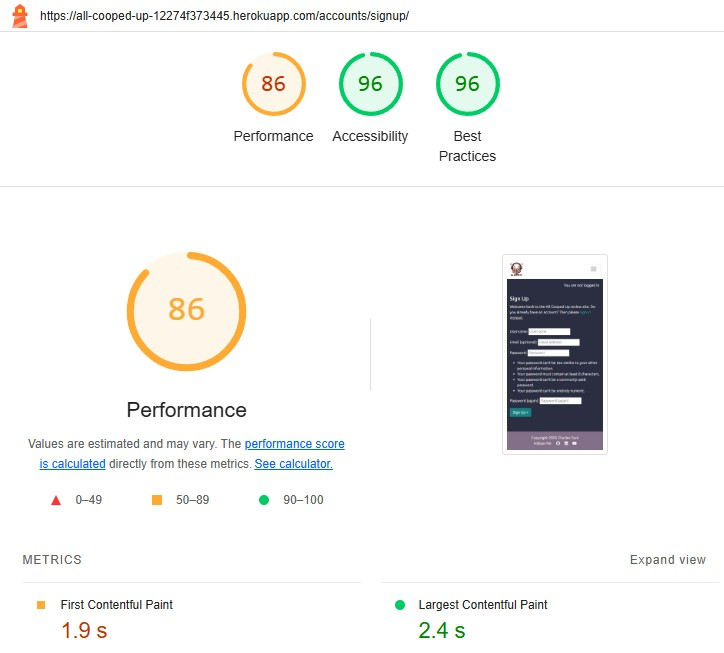

**Test 17:** signup.html(DESKTOP).
- Performance 100.
- Accessibility 96.
- Best Practices 100.  

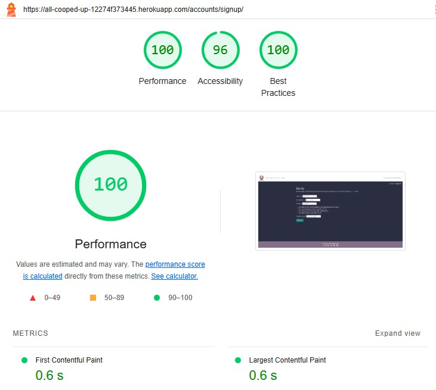

**Test 18:** password_reset.html(MOBILE).
- Performance 97.
- Accessibility 95.
- Best Practices 96.  

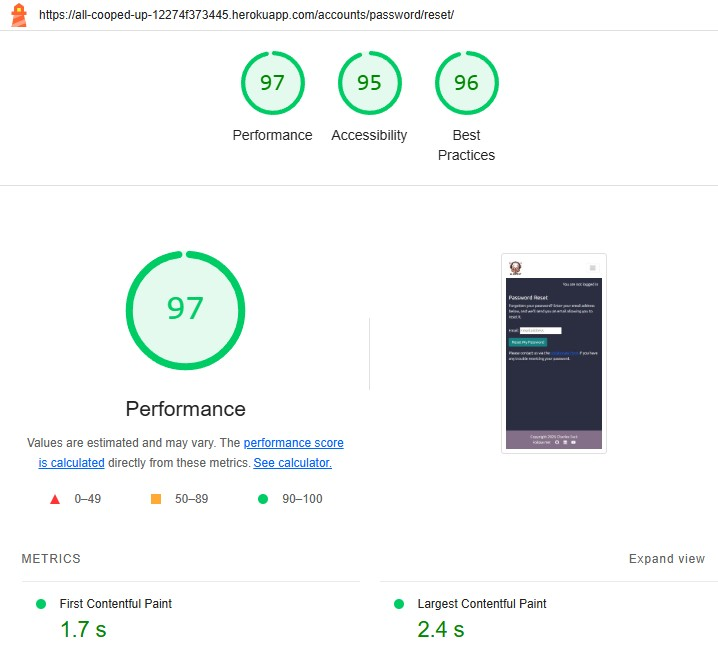

**Test 19:** password_reset.html(DESKTOP).
- Performance 99.
- Accessibility 95.
- Best Practices 100.  

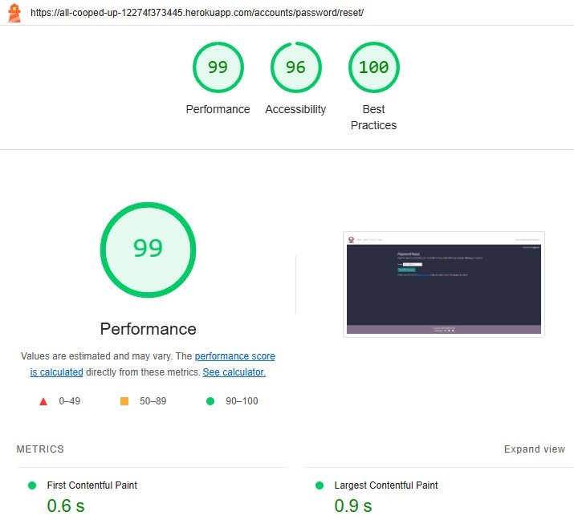

**Back to the [table of contents](https://github.com/CharlesTack/AllCoopedUp/blob/main/static/readme/documents/testing.md#table-of-contents)**

### Python
Code Institute's own [Python Linter](https://pep8ci.herokuapp.com/) for checking Python PEP8 compliance.  
I first ensured that imports were in the correct order at the top of each page - those being standard library imports (e.g. from os), 3rd party imports (e.g from django), and local imports (e.g. from .models).  
I checked and corrected any which were in the incorrect order.  
Using the Python Linter, I went through all python files and fixed problems which were mainly caused by whitespace and lines being too long.  By the end of testing and correction the Flake8 linter extension in VS Code was showing zero "problems" in my code.  I have compiled a log of all of the errors and confirmation of clearance of errors in the table and images below.

#### Python PEP8 Log:

| Python page             | Imports ordered | Python Linter Test 1                                                                                                                                                                                                                                                                                                                                                                                                                                                                                                                                                                                                                                                                                                                           | Python Linter Test 2       | Image of All clear |
| ----------------------- | --------------- | ---------------------------------------------------------------------------------------------------------------------------------------------------------------------------------------------------------------------------------------------------------------------------------------------------------------------------------------------------------------------------------------------------------------------------------------------------------------------------------------------------------------------------------------------------------------------------------------------------------------------------------------------------------------------------------------------------------------------------------------------- | -------------------------- | ------------------ |
| about/admin.py          | Yes             | All clear, no errors found                                                                                                                                                                                                                                                                                                                                                                                                                                                                                                                                                                                                                                                                                                                     | N/A                        | Yes                |
| about/apps.py           | Yes             | All clear, no errors found                                                                                                                                                                                                                                                                                                                                                                                                                                                                                                                                                                                                                                                                                                                     | N/A                        | Yes                |
| about/forms.py          | Yes             | All clear, no errors found                                                                                                                                                                                                                                                                                                                                                                                                                                                                                                                                                                                                                                                                                                                     | N/A                        | Yes                |
| about/models.py         | Yes             | 30: W292 no newline at end of file                                                                                                                                                                                                                                                                                                                                                                                                                                                                                                                                                                                                                                                                                                             | All clear, no errors found | Yes                |
| about/urls.py           | Corrected       | All clear, no errors found                                                                                                                                                                                                                                                                                                                                                                                                                                                                                                                                                                                                                                                                                                                     | N/A                        | Yes                |
| about/views.py          | Yes             | 18: E501 line too long (104 > 79 characters)                                                                                                                                                                                                                                                                                                                                                                                                                                                                                                                                                                                                                                                                                                   | All clear, no errors found | Yes                |
| allcoopedup/settings.py | Yes             | All clear, no errors found                                                                                                                                                                                                                                                                                                                                                                                                                                                                                                                                                                                                                                                                                                                     | N/A                        | Yes                |
| allcoopedup/urls.py     | Yes             | All clear, no errors found                                                                                                                                                                                                                                                                                                                                                                                                                                                                                                                                                                                                                                                                                                                     | N/A                        | Yes                |
| review/admin.py         | Corrected       | 17: W292 no newline at end of file                                                                                                                                                                                                                                                                                                                                                                                                                                                                                                                                                                                                                                                                                                             | All clear, no errors found | Yes                |
| review/apps.py          | Yes             | All clear, no errors found                                                                                                                                                                                                                                                                                                                                                                                                                                                                                                                                                                                                                                                                                                                     | N/A                        | Yes                |
| review/forms.py         | Yes             | 5: E302 expected 2 blank lines, found 1 15: W291 trailing whitespace 19: W291 trailing whitespace 29: E501 line too long (90 > 79 characters) 30: E501 line too long (93 > 79 characters) 33: E302 expected 2 blank lines, found 1 40: E501 line too long (86 > 79 characters) 41: E501 line too long (100 > 79 characters) 42: E501 line too long (100 > 79 characters) 43: E501 line too long (83 > 79 characters) 44: E501 line too long (85 > 79 characters) 44: W292 no newline at end of file                                                                                                                                                                                                           | All clear, no errors found | Yes                |
| review/models.py        | Yes             | 15: E122 continuation line missing indentation or outdented 16: E122 continuation line missing indentation or outdented 36: W293 blank line contains whitespace 40: E302 expected 2 blank lines, found 1 42: E122 continuation line missing indentation or outdented 43: E122 continuation line missing indentation or outdented 45: E122 continuation line missing indentation or outdented 46: E122 continuation line missing indentation or outdented 52: W293 blank line contains whitespace 54: W292 no newline at end of file                                                                                                                                                                                 | All clear, no errors found | Yes                |
| review/urls.py          | Yes             | 10: E501 line too long (96 > 79 characters) 11: E501 line too long (102 > 79 characters) 12: W292 no newline at end of file                                                                                                                                                                                                                                                                                                                                                                                                                                                                                                                                                                                                              | All clear, no errors found | Yes                |
| review/views.py         | Yes             | 57: E501 line too long (82 > 79 characters) 88: E501 line too long (101 > 79 characters) 114: E501 line too long (80 > 79 characters) 116: E501 line too long (94 > 79 characters) 141: E261 at least two spaces before inline comment 141: E501 line too long (101 > 79 characters) 145: E261 at least two spaces before inline comment 146: E501 line too long (85 > 79 characters) 148: E501 line too long (109 > 79 characters) 149: E501 line too long (131 > 79 characters) 154: E302 expected 2 blank lines, found 1 171: E501 line too long (84 > 79 characters) 175: E302 expected 2 blank lines, found 1 179: E501 line too long (105 > 79 characters) 191: W292 no newline at end of file | All clear, no errors found | Yes                |
| env.py                  | Yes             | 4: E501 line too long (135 > 79 characters) 10: E501 line too long (91 > 79 characters) 10: W292 no newline at end of file                                                                                                                                                                                                                                                                                                                                                                                                                                                                                                                                                                                                               | All clear, no errors found | Yes                |  

**Back to the [table of contents](https://github.com/CharlesTack/AllCoopedUp/blob/main/static/readme/documents/testing.md#table-of-contents)**

#### Individual Images:

**about/admin.py**

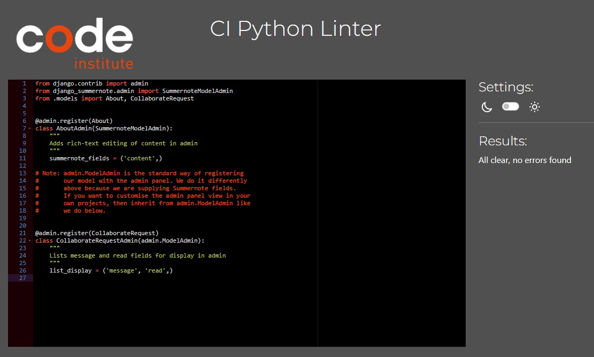

**about/apps.py**

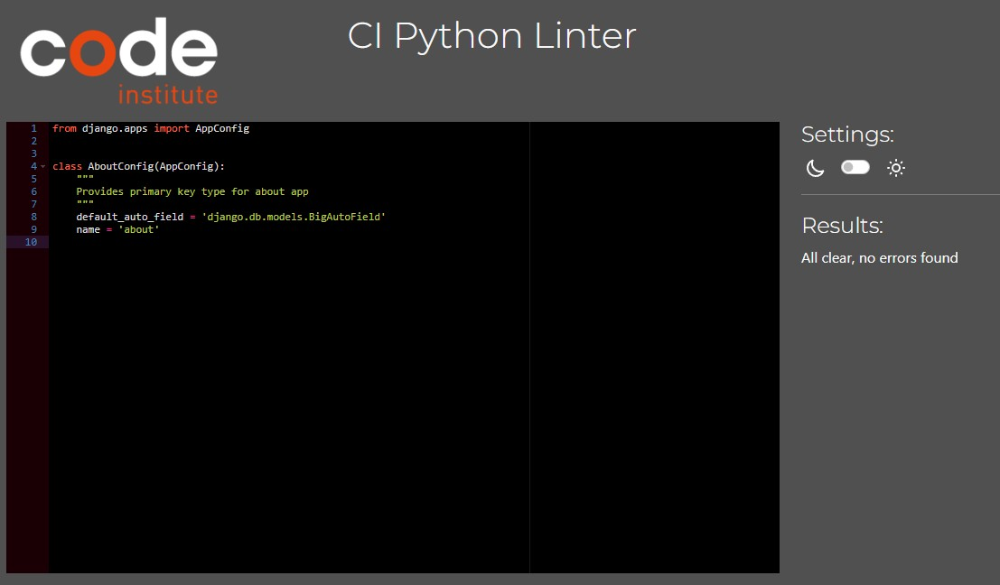

**about/forms.py**

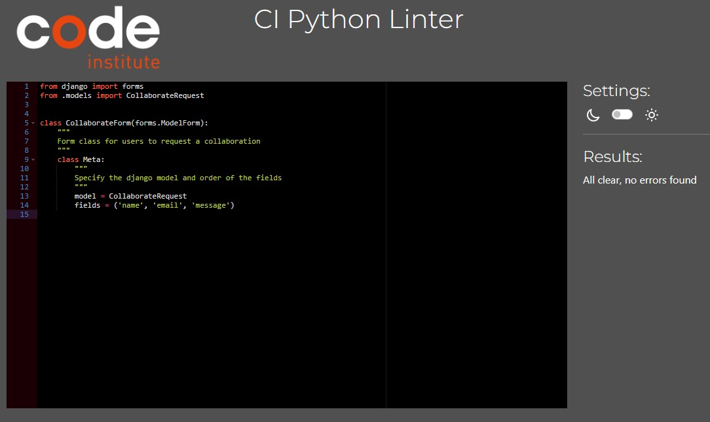

**about/models.py**

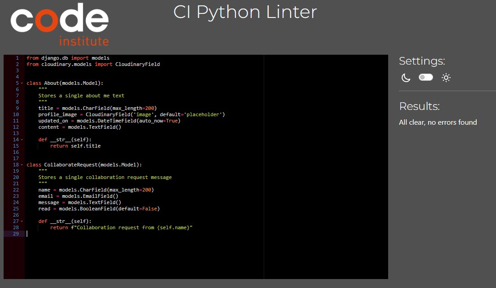

**about/urls.py**

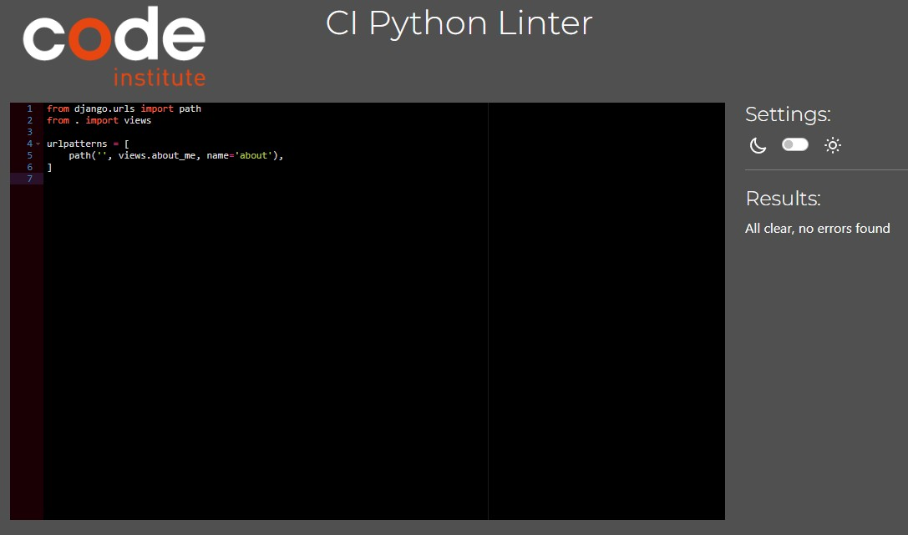

**about/views.py**

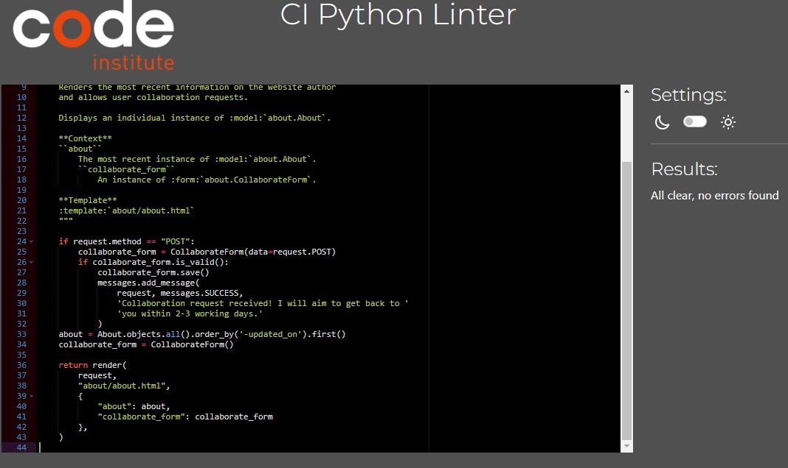

**allcoopedup/settings.py**

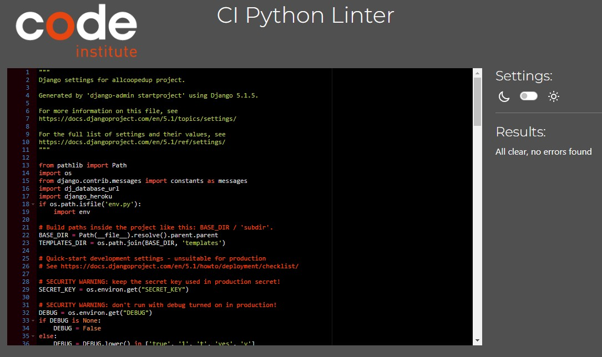

**allcoopedup/urls.py**

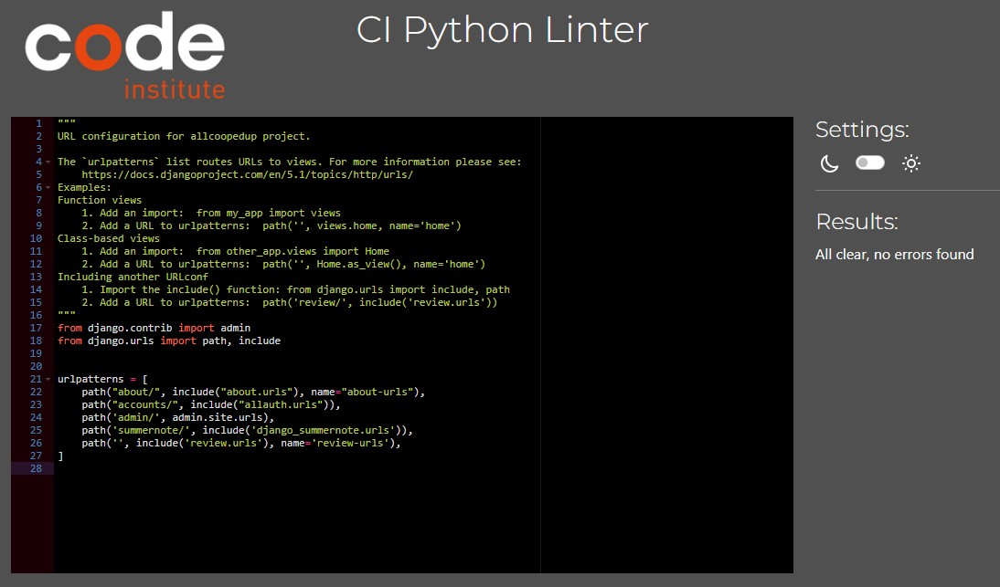

**review/admin.py**

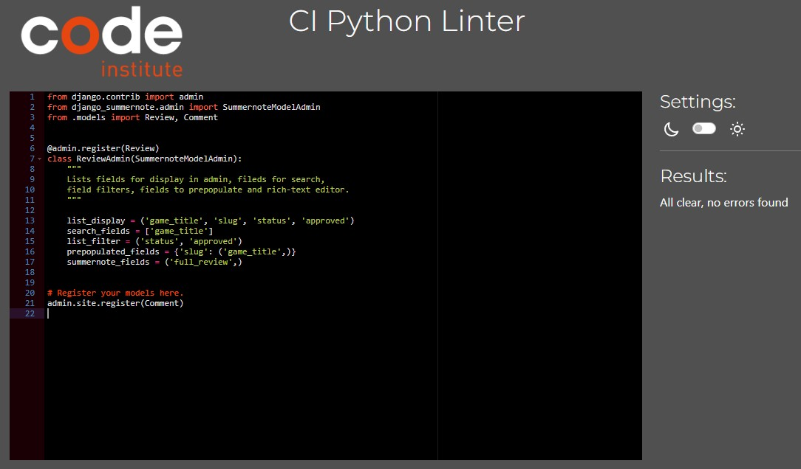

**review/apps.py**

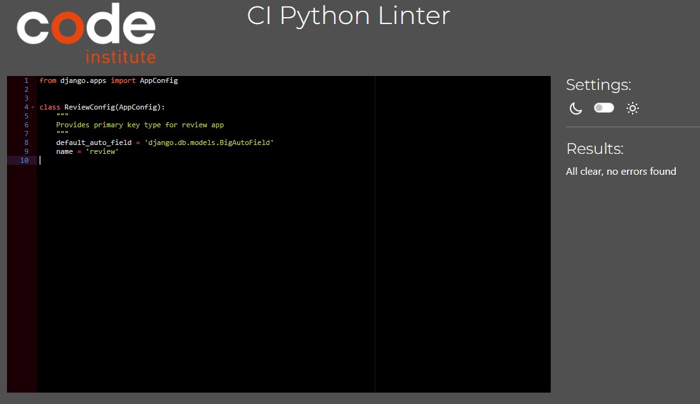

**review/forms.py**

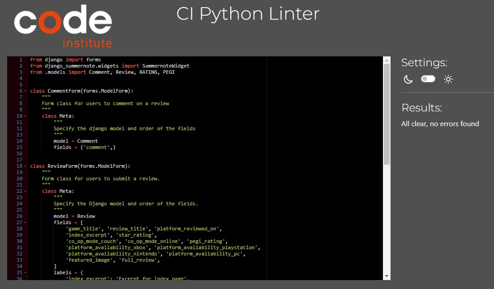

**review/models.py**

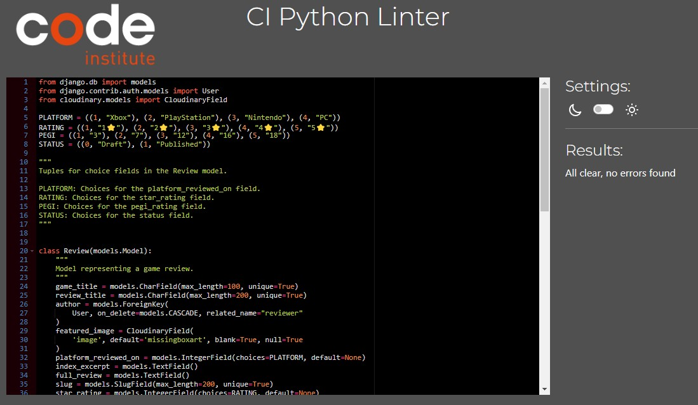

**review/urls.py**

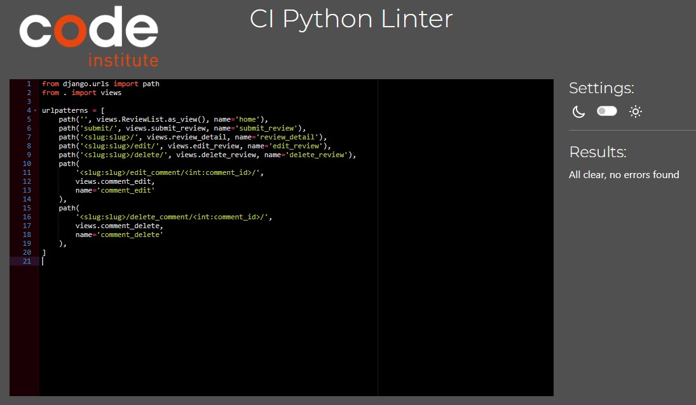

**review/views.py**

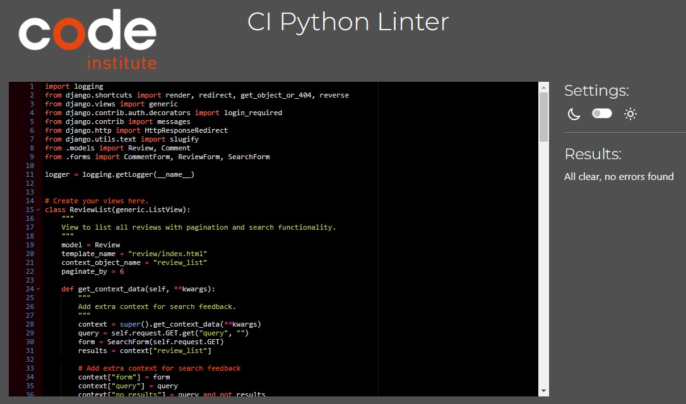

**env.py**

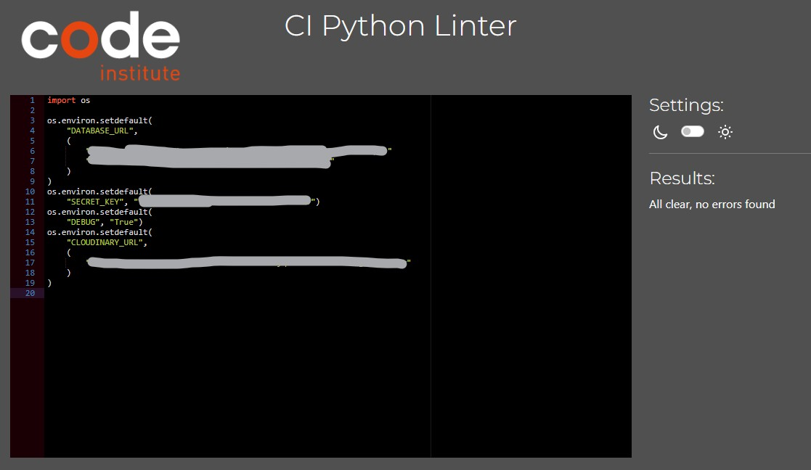

**Back to the [table of contents](https://github.com/CharlesTack/AllCoopedUp/blob/main/static/readme/documents/testing.md#table-of-contents)**