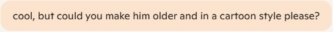
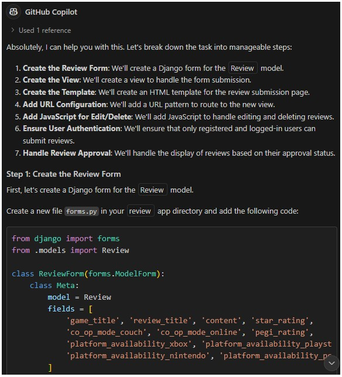
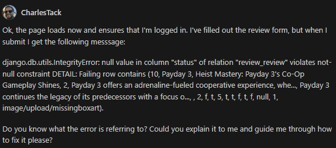
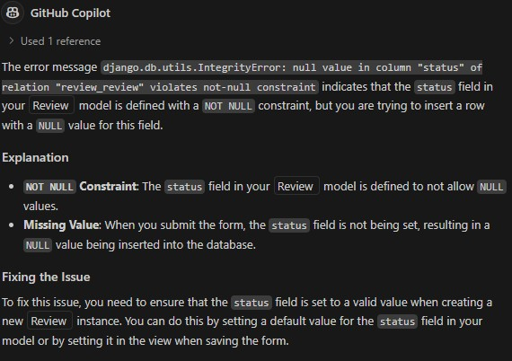
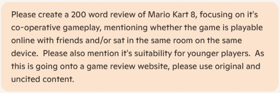
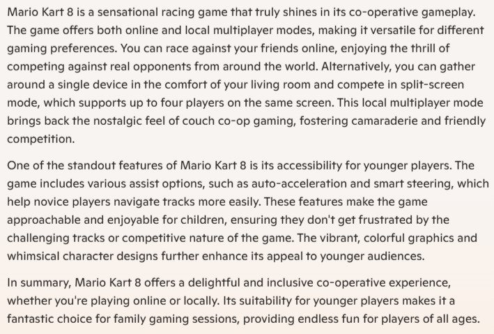

# Some examples of AI usage  
A note on casual language:  
When working alone it can be useful to write (or even speak, as the tools can be configured to accept audio) in a casual tone to reduce any feelings of isolation.  This approach can be noted in many of the prompt examples below.

## Image creation
Microsoft Copilot was utilised outside of VS Code to assist with image creation.  It's first usage was to create an image which could be used as a placeholder in case of missing images on the site.  The prompt is was given was:  
  
Copilot generated the following image:  
  
This was a pretty acurate image considering the lack of accuracy of my initial prompt.  The prompt was refined (with fairly casual language!) to get closer to the imagined image:  
  
This produced the following image:  
  
The image was exactly what was imagined, and the added question marks (which hadn't been requested) worked even better when the image was cropped.  
This in turn influenced the outfit and pose for the "About Me" profile picture:  

## Workflow Direction
Microsoft Copilot was used within VS Code for a multitude of purposes, not least including setting the direction for workflow.  A tutorial from a previuos project had been used as a guide in the early stages of coding, but once the tutorial had finished it was unclear how to progress further.  A detailed prompt, in casual language, was put to Copilot to seek guidance:  

_Just to set the context of what I'm doing today...  I'm making a video game review site using python, Django, html, css and JavaScript (plus Bootstrap).  I've been following a tutorial from a course I'm taking which has got me to a certain point, but I now need to add my own pages and functionality so that my project is different to that created in the tutorial.  The first stage of that is to create a page where users can submit their own reviews.  A model exists for this in the review/models.py file (class Review), and I know that I'll have to load most of the fields from that into a form for the user to fill in.  The user needs to be registered and logged in to submit their review, and similar code exists in the Comments section of review/review_detail.html to facilitate that (as well as confirming that the review has been submitted).  I know I also need to create JavaScript code to allow the user to edit and delete their review, and the view of their review needs to be similarly greyed out (like the comments in review/review_detail.html) when they are pending administrator's approval.  I'd really like your help and guidance to get this done.  I need to fully understand everything that you're suggesting and for it to be broken down into multiple steps so that I can follow it.  I'm very new to coding and all of the languages I've mentioned above, so please treat me as a beginner.  Are you able to help me with this please?_  

This also served as a "thinking out loud" activity to understand the next steps of what needed to be done.  

What was particularly useful was the change in the order of tasks.  An initial plan (prior to Copilot consultation) had been to start with the submit_review.html page as it felt natural to build the structure/shell of the page before adding the functionality.  This was also an emotional choice rather than a logical one as that approach felt like a less potentially destructive path which relied on coding languages where more confidence was felt.  
Copilot set a different path and provided guidance through every step of the way:  
  
Each step was fully explained and detailed, whilst providing the space and time to feel confident in comprehension, usage and code implementation (without errors).  

Full details of every step can be found in the [development diary](../documents/Development%20Diary.docx).  To access, follow the link and click "Download raw file".

## Error Handling
Copilot is an amazing tool for providing solutions to bugs and errors when it's given enough data and context.  In an early stage of getting user-generated reviews to work, an error was encountered which was posed to Copilot:
  
Copilot provided a succinct response which helped guide to the cause of the error and the eventual solution:

There are multiple examples of this type of interaction in the development diary.

## Game review generation
Copilot outside of VS Code was used to create user reviews to populate the site with.  An example of a prompt and Copilot-generated review is below:
  

Careful consideration was given to ensuring that the reviews were free of copyright infringements, as AI can and does use review text from published sources which would need to be cited correctly.